# Flexiv Rizon 4s：Simscape → MuJoCo 仿真环境

<!-- S01 CURRENT START -->
## 当前版本：S01 原文兼容 SRS 基准与完整可视化

发布分支：`codex/system-s01-paper-bridge`。数学检查11/11；来源参数为 **SOURCE_LIMITED**。
C2动力学合格 **6/9**；可用C2记录均独立重放通过，但C1有1次不可恢复的原始输入记录缺口，全批重放为 **PARTIAL**。

- [统一可视化入口](output/fpmfc/system_capture/visualizations/README.md) · [本地交互图集](output/fpmfc/system_capture/visualizations/index.html)
- [S01报告](output/fpmfc/system_capture/S01/report.md) · [资格字段](output/fpmfc/system_capture/S01/qualification.json) · [逐项验收](output/fpmfc/system_capture/S01/completion_audit.json) · [复现章节](paper/system_framework/reproduction_section.md)
- [SRS五视角与连续体侧视频](output/fpmfc/system_capture/S01/visualizations/srs_author_point_five_views_and_body_side.mp4) · [SRS实际跟踪误差](output/fpmfc/system_capture/S01/figures/tracking_and_dynamics.png)
- [完整捕获五视角与连续体侧总览](output/fpmfc/n209_paper_system/visualizations/overview_five_views_and_body_side.mp4) · [独立体侧视频](output/fpmfc/n209_paper_system/visualizations/body_side.mp4)
- [完整捕获末端轨迹](output/fpmfc/n209_paper_system/visualizations/trajectory.png) · [跟踪误差](output/fpmfc/n209_paper_system/visualizations/tracking.png)

本次刷新4组S01核心图及1段SRS视频，同时重新生成保存的N209全部88组诊断图、5组论文主图及8段同步视频。新SRS为接触前基准，N209视频为已有Flexiv连续捕获记录；各自的模型、数据来源和失败结论在图集中明确标注。未运行S02—S08。

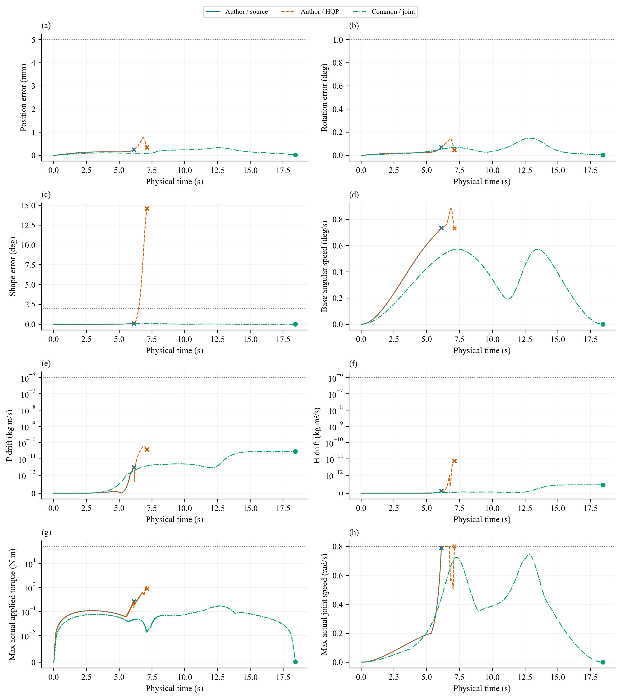

<!-- S01 CURRENT END -->

<!-- S00 CURRENT START -->
## 历史基础：S00 契约、基线适配与完整可视化

S00 历史发布分支：`codex/system-s00-visual-refresh`。S00 验收快照：`80ac0f69faa258cba61a2623a4f55961e7ffbebb`。
统一接口测试 **23/23**，既有轨迹的两类兼容性重放 **4/4**；没有新增物理实验，验收时未执行 S01—S08。

- [S00 阶段报告](output/fpmfc/system_capture/S00/report.md) · [交接清单](output/fpmfc/system_capture/S00/handoff.json) · [逐项验收](output/fpmfc/system_capture/S00/completion_audit.json)
- [最新完整图集](output/fpmfc/n209_paper_system/visualizations/README.md) · [本地 HTML](output/fpmfc/n209_paper_system/visualizations/index.html) · [刷新与来源清单](output/fpmfc/n209_paper_system/visualizations/refresh_manifest.json)

下方视频和诊断图均由已保存的 N209 轨迹刷新。S00 的接口兼容性通过不改变既有物理任务的成功/失败结论。
<!-- S00 CURRENT END -->

<!-- N209 CURRENT START -->
## 保存的完整捕获结果 N209：估计不确定性与参考可实现性

**PARTIAL_OPERATING_DOMAIN_MISMATCH**：8 条已见开发/回归中，3 条完成、5 条早停；全部统一双重重放通过。H2/S01 未完成，独立验证未准入。论文数据审计为 WARN，无实质数值不符；这不是鲁棒性能或硬件就绪结论。

- [完整报告](paper/N209_FEASIBILITY_AND_UNCERTAINTY_REPORT.md) · [论文 V1](paper/system_paper/manuscript_v1.md) · [审计](paper/PAPER_CLAIM_AUDIT.md)
- [当前全部可视化：8 个视频、88 组逐运行诊断图和5组论文主图](output/fpmfc/n209_paper_system/visualizations/README.md) · [本地图集](output/fpmfc/n209_paper_system/visualizations/index.html)
- [五视角与连续体侧总览](output/fpmfc/n209_paper_system/visualizations/overview_five_views_and_body_side.mp4) · [独立连续体侧视频](output/fpmfc/n209_paper_system/visualizations/body_side.mp4) · [接口近景](output/fpmfc/n209_paper_system/visualizations/interface_closeup.mp4)
- [末端实际/参考轨迹](output/fpmfc/n209_paper_system/visualizations/trajectory.png) · [跟踪误差](output/fpmfc/n209_paper_system/visualizations/tracking.png) · [所有8条运行](output/fpmfc/n209_paper_system/visualizations/README.md#全部运行)

视频来自最终 V2 名义回归 `R01_V2_nominal`：7.992 s 锁紧，完整运行至27.992 s。参考在锁紧后停用，抓后保持量单独展示。所有失败记录仍可在图集中查看。

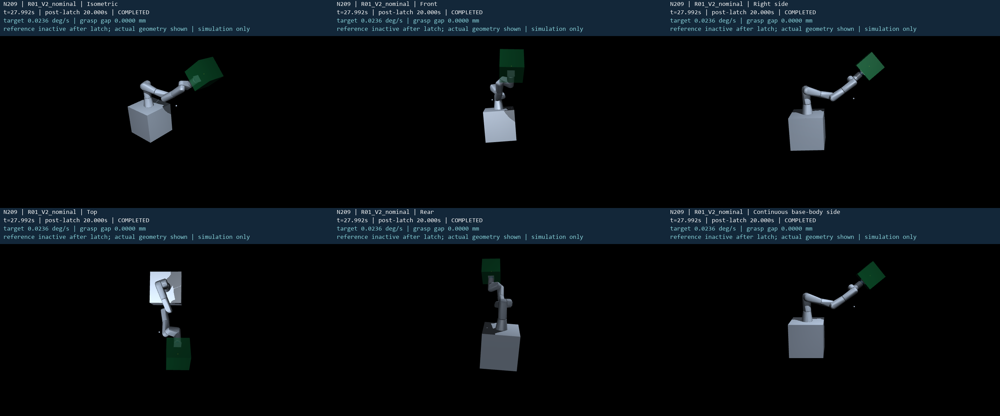
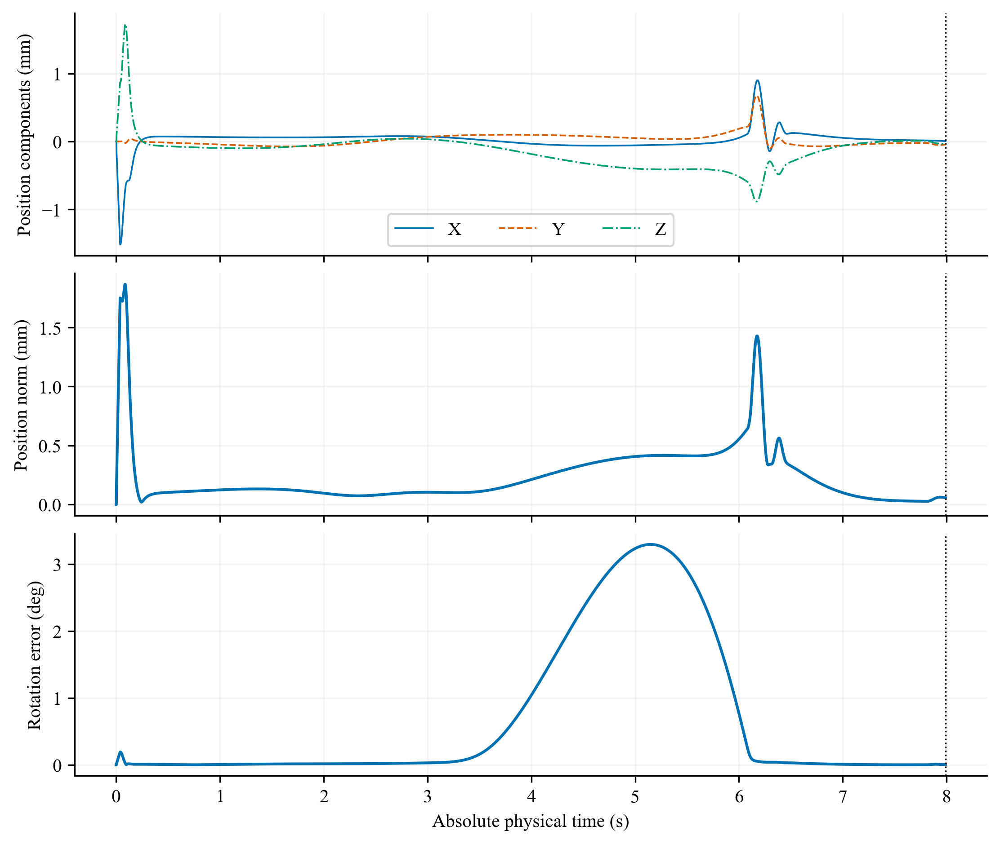

下面 N208 及更早内容为历史记录，不作为当前 N209 的新增验证。
<!-- N209 CURRENT END -->

<!-- N208 CURRENT START -->
## 历史 N208：被动目标估计与事件捕获

选中运行 `D06_final_gain3`：连续任务 **True**，固定末窗消旋 **True**。共记录 15 次完整机器人尝试，所有早停保留。自然任务全惯性辨识尚未验证；任务完成与参数识别分别判定。

- [本轮报告](paper/N208_PASSIVE_TARGET_ESTIMATION_CAPTURE_REPORT.md) · [全部运行比较](output/fpmfc/n208_adaptive_capture/comparison.json) · [资格矩阵](output/fpmfc/n208_adaptive_capture/qualification_matrix.json)
- [本轮全部科学图与两条视频](output/fpmfc/n208_adaptive_capture/visualizations/index.html)
- [五个固定视角与连续体侧合成视频](output/fpmfc/n208_adaptive_capture/visualizations/overview_five_views_and_body_side.mp4) · [接口近景](output/fpmfc/n208_adaptive_capture/visualizations/interface_closeup.mp4)
- [末端实际/参考轨迹](output/fpmfc/n208_adaptive_capture/visualizations/trajectory.png) · [末端跟踪误差](output/fpmfc/n208_adaptive_capture/visualizations/tracking.png)

仿真传感器、软件锁紧与有限场景证据；无真实夹爪、硬件承载或实时就绪声明。下列 N110—N206 内容保留为历史记录。
<!-- N208 CURRENT END -->

## 历史 N206：几何修复通过，t=8 s 实际捕获门失败

旧终端 **−0.292937 mm** 干涉由原始碰撞 STL 三角面独立确认。采用有实体支撑和正质量的 **20 mm 工具安装增量**，新增约 **0.205738 kg**；这是未经硬件批准的仿真设计候选。新几何、三条全时域参考筛查和受影响接口测试已完成，标准 C1 按几何/运动学规则选中。

名义真实运行到 **8.000 s**，link7—目标间隙仍为正；四项实际捕获量越门，**未锁紧、未完成18 s、未评价固定[16,18] s消旋**。一次正式尝试，独立记录输入重放通过且状态误差为零；fine/light/heavy按规则跳过。原增益、阻尼、连接参数、安全门和捕获时刻均未放宽。

- [N206 完整报告](paper/N206_GEOMETRY_COMPATIBILITY_REPORT.md) · [资格矩阵](output/fpmfc/n206_geometry_capture/qualification_matrix.json) · [运行账本](output/fpmfc/n206_geometry_capture/run_ledger.json)
- [本轮全部可视化入口](output/fpmfc/n206_geometry_capture/visualizations/index.html)：13组图及2个视频，只使用本轮实际证据。
- [五视角与连续基座体侧合成视频](output/fpmfc/n206_geometry_capture/visualizations/overview_five_views_and_body_side.mp4) · [接口近景](output/fpmfc/n206_geometry_capture/visualizations/interface_closeup.mp4)
- [执行命令](output/fpmfc/n206_geometry_capture/commands.md) · [完成审计](output/fpmfc/n206_geometry_capture/completion_audit.json)

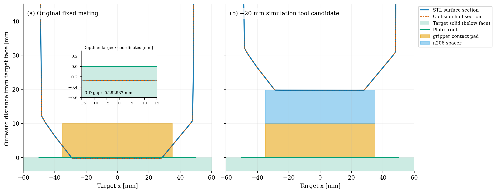
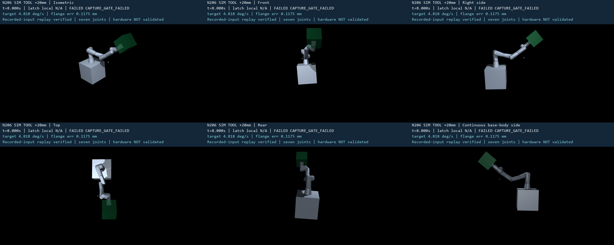
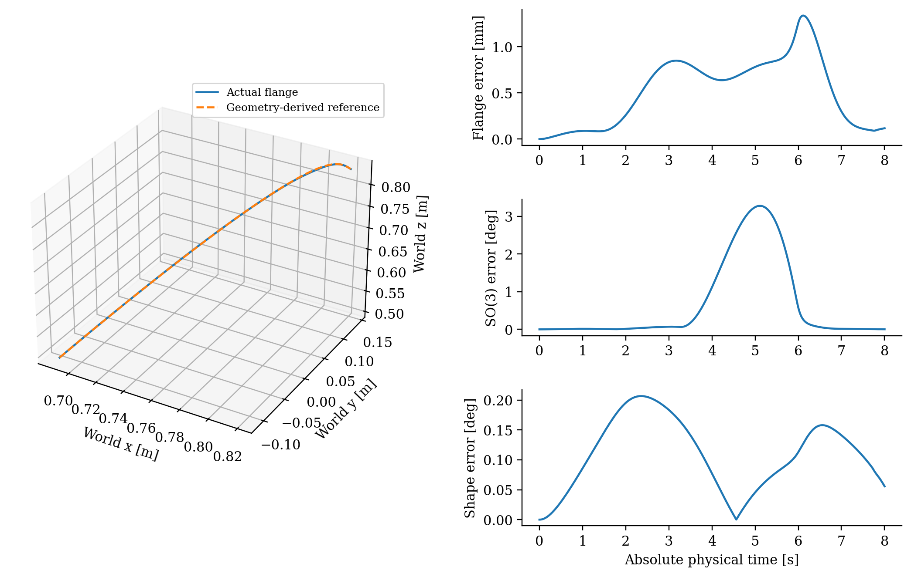
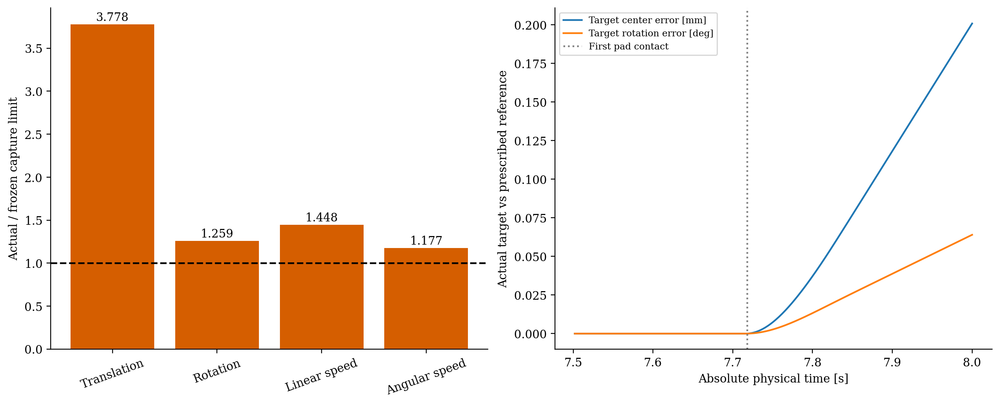

以下目录与结果均为历史记录，不构成本轮新工具模型的成功证据。

## 历史 N205：连续接近验证在 7.362 s 安全早停

从 home 和自由目标 t=0 连续积分。link7—目标立方体距离达到 **0.989620 mm**，触发预注册的 1 mm 余量门（含10 μm数值容差）。未发生 pad/plate 接触，未到达8 s捕获检查；**锁紧、18 s完整运行及16–18 s消旋均未验证**。记录输入重放通过。fine/light/heavy按失败准入规则未运行，未放宽门或重试。

- [N205 完整报告](paper/N205_END_TO_END_CAPTURE_DETUMBLING_REPORT.md) · [状态矩阵](output/fpmfc/n205_end_to_end/qualification_matrix.json) · [运行账本](output/fpmfc/n205_end_to_end/run_ledger.json)
- [N205 可视化入口](output/fpmfc/n205_end_to_end/visualizations/index.html)：真实停止时域的总览、接口近景、五视角合成、连续体侧镜头及科学图。
- [五视角视频](output/fpmfc/n205_end_to_end/visualizations/five_views.mp4) · [接口近景](output/fpmfc/n205_end_to_end/visualizations/interface_closeup.mp4) · [体侧视频](output/fpmfc/n205_end_to_end/visualizations/body_side.mp4)
- [执行命令](output/fpmfc/n205_end_to_end/commands.md) · [完成审计](output/fpmfc/n205_end_to_end/completion_audit.json)

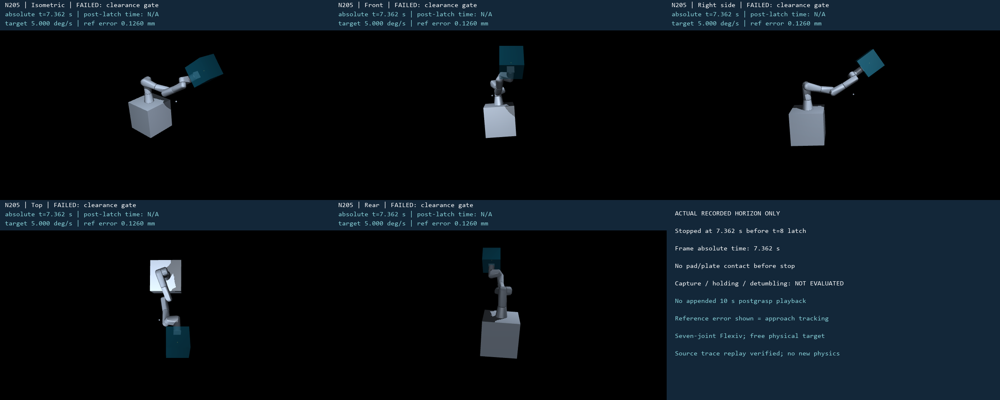
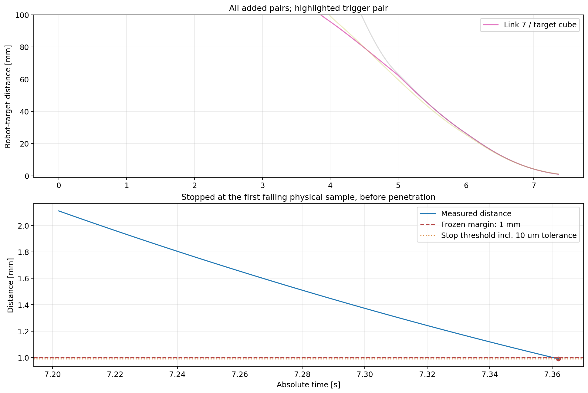
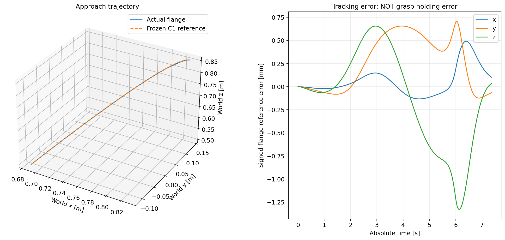

## 历史 N201S–N204：C1 快照后等效锁紧、保持与消旋

名义、16 kg、24 kg 三个明确模型场景均完成 10 s，通过固定最后 2 s 的角速度门与全程安全门。使用原七关节阻尼；未新增治理器。19 项受限夹具试验、7 次组合体尝试（6 条完整，P_Z 保留为 6 ms 诊断误停）、8 次记录输入重放。旧满边界资格仍失败；真实夹爪、硬件承载和完整接近抓捕未验证。

- [完整报告](paper/POSTGRASP_DETUMBLING_CAMPAIGN_REPORT.md) · [最终状态矩阵](output/fpmfc/postgrasp_campaign/qualification_matrix.json) · [实际运行账本](output/fpmfc/postgrasp_campaign/run_ledger.json)
- [全部可视化入口（下载后浏览器打开）](output/fpmfc/postgrasp_campaign/visualizations/index.html)：六条完整轨迹的五个单独视角、五视角合成及连续体侧镜头，共 42 个视频。
- [名义五视角视频](output/fpmfc/postgrasp_campaign/visualizations/L_nominal/five_views.mp4) · [随基座运动的连续体侧视频](output/fpmfc/postgrasp_campaign/visualizations/L_nominal/body_side.mp4)
- [执行与重放命令](output/fpmfc/postgrasp_campaign/commands.md) · [完成审计](output/fpmfc/postgrasp_campaign/completion_audit.json)

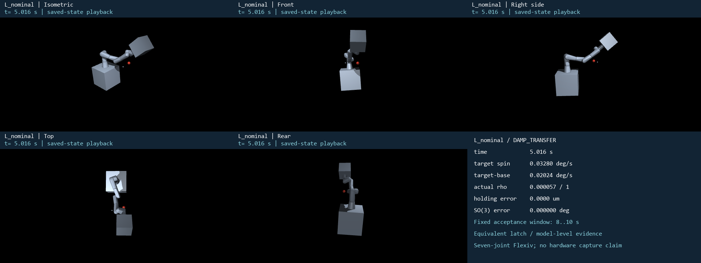
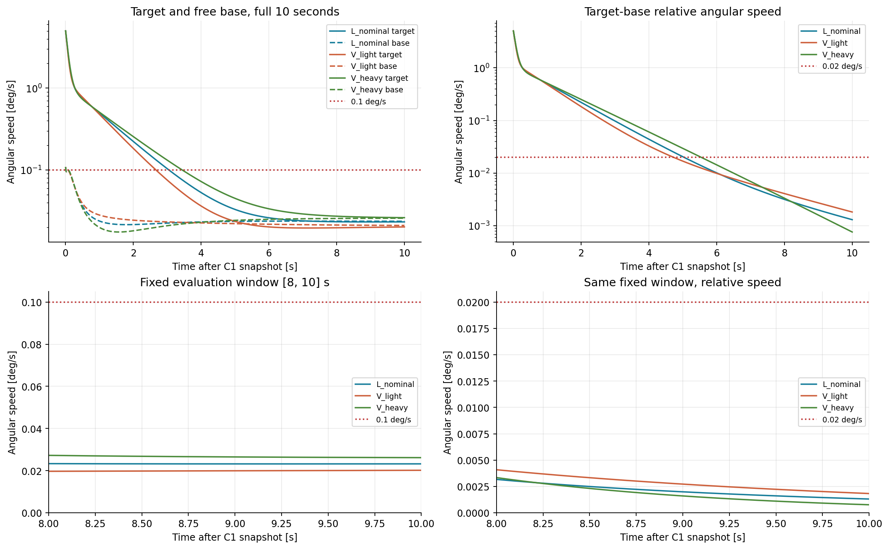
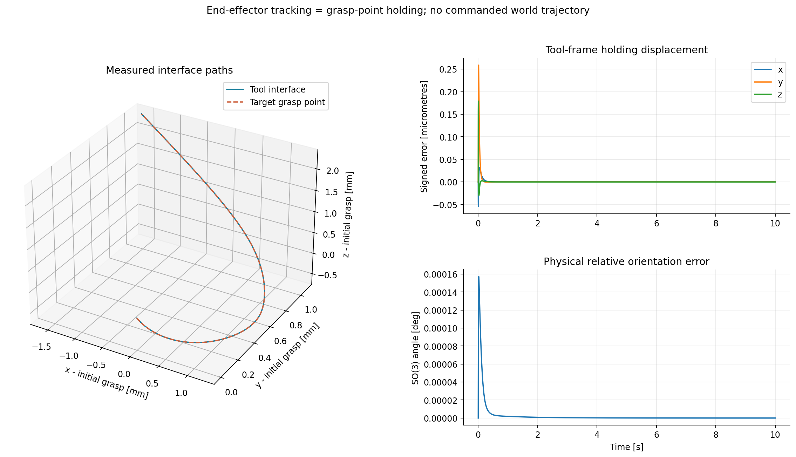

下文保留原环境迁移与历史实验说明；其可视化不作为本次 campaign 证据。

本目录把指定的自由漂浮卫星 + Flexiv Rizon 4s Simscape 模型迁移为可独立运行的 MuJoCo 环境，并将 `v6_lite` 的确定性控制与验收架构适配到源模型真实具备的 7 个关节。

## 迁移结果

```text
7 点 seeded irregular waypoints（场景层）
                    ↓ C2 minimum-jerk pose / twist
单个优先级加权约束速度 QP（50 Hz）
  ├─ 末端位置和姿态任务
  ├─ 关节位置 / 速度 / 加速度硬约束
  ├─ 自由基座零动量 reaction map
  └─ MuJoCo 精确有符号距离 barrier
                    ↓ 20 ms 速度斜坡
模型逆动力学关节力矩伺服（500 Hz）
                    ↓
自由漂浮 500 kg 基座 + 7-DOF Rizon 4s
                    ↓
NPZ 力矩轨迹、指标、SHA-256 清单、独立逐步回放
```

在线代码不依赖学习模型、diffusion、候选轨迹循环或 oracle。QP 每 20 ms 恰好求解一次；500 Hz 层只执行确定性逆动力学力矩律，仿真开始后不写 `qpos/qvel`。

## 与原 V6-lite 的边界

参考工程是 17 维双臂/连续体规划器和 67 路低层执行器；指定 `.slx` 实际是单台 7-DOF Flexiv。因此这里保留 V6 的逻辑结构、时间尺度、安全约束、日志和重放验证，但规划变量与执行器都按真实源模型收敛为 7 维，不虚构连续体臂或第二台机械臂。

源 Simscape 模型的几何、关节轴、限位、质量、质心、500 kg 自由基座和零重力条件均被保留。源模型允许若干主惯量为零，而 MuJoCo 要求正定惯量；仅这些零项使用相邻 ROS 描述中的正值近似进行了正则化，详见 `assets/SOURCE_PROVENANCE.md`。

## 运行

推荐使用已验证的环境：

```powershell
C:\Users\admin\.conda\envs\rltoorch\python.exe -m v6_mujoco.run
```

默认运行 5 个固定种子，每个 25.5 s（4.5 s 过渡 + 21 s 不规则路径）。快速冒烟测试：

```powershell
C:\Users\admin\.conda\envs\rltoorch\python.exe -m v6_mujoco.run --scenario-count 1 --duration 0.5 --output-dir output_smoke
```

独立重放并验收默认输出：

```powershell
C:\Users\admin\.conda\envs\rltoorch\python.exe -m v6_mujoco.validate
```

打开第一个场景的交互式回放：

```powershell
C:\Users\admin\.conda\envs\rltoorch\python.exe -m v6_mujoco.viewer
```

生成 5 场景跟踪图、误差曲线、基座漂移图、QP/安全图，以及场景 00 的五视角 H.264 视频：

```powershell
C:\Users\admin\.conda\envs\rltoorch\python.exe -m v6_mujoco.visualize
C:\Users\admin\.conda\envs\rltoorch\python.exe -m v6_mujoco.validate_visualizations
```

五个视频采用等轴、正面、右侧、俯视和后方同步视角，画面包含时间、末端误差、最小间距及 Y–Z 跟踪小窗。三维场景中持续显示绿色 W1–W7 目标路径、7 个金色目标点及各目标点的淡色 RGB 坐标系；正面视频额外标注 W1–W7。视频逐帧同步绘制当前目标点坐标系和 Flexiv 法兰坐标系：RGB 分别表示 XYZ，当前目标为长半透明箭头，实际末端为短实心箭头。三维路径图同样在 W1–W7 绘制目标坐标系，并在终点叠加目标/实际末端坐标系。可通过 `--scenario 1` 等参数为其他种子重新生成五视角视频。

运行回归测试：

```powershell
C:\Users\admin\.conda\envs\rltoorch\python.exe -m unittest tests.test_mujoco_migration -v
```

## 论文方法复现与自定义场景验证

`v6_mujoco/fpmfc` 在上述迁移基线上重新实现论文的方法思想：从完整质量矩阵计算自由基座零动量映射与广义雅可比，用 Flexiv 的 S–E–W 几何臂形角替代理想 SRS 解析角，采用末端一级、臂形与基座反作用二级的严格 HQP，并联合优化捕获时间与终端臂形。模型、目标、抓捕点、质量惯量、约束和步长均采用本项目设置，因此目标是方法复现与用户场景验证，不是复现论文的具体数值。

数学与控制回归测试：

```powershell
C:\Users\admin\.conda\envs\rltoorch\python.exe -m unittest discover -s tests -p "test_fpmfc_*.py" -v
```

运行一个短 PSO（仅用于冒烟测试；正式配置为 20 粒子、最多 1000 代、10 个种子）：

```powershell
C:\Users\admin\.conda\envs\rltoorch\python.exe -m v6_mujoco.fpmfc.optimizer --config configs/fpmfc_paper.yaml --seed 0 --population 4 --generations 2 --output output/fpmfc/optimization/smoke.json
```

优化器同时写入同名 `.jsonl` 每代进度，并在最终 JSON 中保存该种子的前 5 个候选，供 500 Hz 动力学排序复核。

固定 `ψ=0` 与 `ψ=π/2` 的命令仅保留用于 N071/N072 补充构型诊断；当前 Flexiv 场景下二者均落入不利构型，不作为复现成败门槛，也不再默认启动完整穷举。若论文确需性能型固定臂形对照，应先预注册并冻结一个或两个可行角度，再使用同一评估器优化捕获时间：

```powershell
C:\Users\admin\.conda\envs\rltoorch\python.exe -m v6_mujoco.fpmfc.optimizer --config configs/fpmfc_paper.yaml --seed 0 --fixed-arm-angle 0.0 --output output/fpmfc/optimization/fixed_psi_0_seed_00.json
C:\Users\admin\.conda\envs\rltoorch\python.exe -m v6_mujoco.fpmfc.optimizer --config configs/fpmfc_paper.yaml --seed 0 --fixed-arm-angle 1.5707963267948966 --output output/fpmfc/optimization/fixed_psi_pi2_seed_00.json
```

批量复核某个种子的前 5 个候选：

```powershell
C:\Users\admin\.conda\envs\rltoorch\python.exe -m v6_mujoco.fpmfc.run_candidates --optimizer-json output/fpmfc/optimization/pso_seed_00.json --config configs/fpmfc_paper.yaml --top-k 5 --output-root output/fpmfc/precontact/seed_00_candidates
```

可断点续跑的多种子联合优化套件（已完成且配置哈希一致的种子会跳过）：

```powershell
C:\Users\admin\.conda\envs\rltoorch\python.exe -m v6_mujoco.fpmfc.pso_suite --config configs/fpmfc_paper.yaml --variants joint --seeds 0 1 2 3 4 5 6 7 8 9 --output-root output/fpmfc/optimization/formal
```

独立种子可并行执行；正式第一批推荐 `--parallel 3`。每个种子仍使用独立 JSON/JSONL，完整结果会按配置哈希安全跳过：

```powershell
C:\Users\admin\.conda\envs\rltoorch\python.exe -m v6_mujoco.fpmfc.pso_suite --config configs/fpmfc_paper.yaml --variants joint --seeds 0 1 2 --population 20 --generations 1000 --planning-clearance 0.045 --parallel 3 --output-root output/fpmfc/optimization/formal_planning45
```

套件完成后，可并行复核所有种子的 top-k；只有规划可行、动力学验收和独立重放同时通过的候选会进入动态排名：

```powershell
C:\Users\admin\.conda\envs\rltoorch\python.exe -m v6_mujoco.fpmfc.run_suite_candidates --suite-summary output/fpmfc/optimization/formal_planning45/pso_suite_summary.json --config configs/fpmfc_paper.yaml --top-k 5 --parallel 3 --output-root output/fpmfc/precontact/formal_planning45_batch_00_02
```

正式优化与动力学回放还记录核心源码及 MuJoCo XML 的组合实现指纹。断点恢复、套件聚合和跨阶段复核都会拒绝实现指纹不一致的旧结果，避免把代码更新前后的数据混入同一正式批次。

权重敏感性不修改源 YAML，而用显式覆盖生成独立有效配置哈希，例如：

```powershell
C:\Users\admin\.conda\envs\rltoorch\python.exe -m v6_mujoco.fpmfc.pso_suite --config configs/fpmfc_paper.yaml --variants joint --objective-weights 1 1 --output-root output/fpmfc/optimization/weights_1_1
C:\Users\admin\.conda\envs\rltoorch\python.exe -m v6_mujoco.fpmfc.pso_suite --config configs/fpmfc_paper.yaml --variants joint --objective-weights 2 1 --output-root output/fpmfc/optimization/weights_2_1
```

规划安全间距也可独立覆盖。以下命令让优化器和控制器使用 45 mm，而保存源配置中的 40 mm 作为最终动力学验收门槛；`run_candidates` 会从优化结果重建覆盖并核验有效配置哈希：

正式 A 级复现已冻结采用这一 45/40 mm 双阈值；不带覆盖的 40 mm 结果仅保留为预检对照。

```powershell
C:\Users\admin\.conda\envs\rltoorch\python.exe -m v6_mujoco.fpmfc.optimizer --config configs/fpmfc_paper.yaml --seed 0 --planning-clearance 0.045 --output output/fpmfc/optimization/planning45_seed0.json
C:\Users\admin\.conda\envs\rltoorch\python.exe -m v6_mujoco.fpmfc.run_candidates --optimizer-json output/fpmfc/optimization/planning45_seed0.json --config configs/fpmfc_paper.yaml --top-k 5 --output-root output/fpmfc/precontact/planning45_seed0_top5
```

在长时重跑前，可固定重评已有 top-k 来诊断新间距的影响；该命令不会重新优化，输出中会显式保留这一证据限制：

```powershell
C:\Users\admin\.conda\envs\rltoorch\python.exe -m v6_mujoco.fpmfc.recheck_candidates --optimizer-json output/fpmfc/optimization/precheck_seed0.json --config configs/fpmfc_paper.yaml --planning-clearance 0.045 --top-k 5 --output output/fpmfc/optimization/precheck_seed0_recheck_planning45.json
```

扫描某个论文固定臂形在捕获时间窗内的可达性：

```powershell
C:\Users\admin\.conda\envs\rltoorch\python.exe -m v6_mujoco.fpmfc.reachability --config configs/fpmfc_paper.yaml --time-start 8 --time-stop 25 --time-step 1 --arm-angles 0 1.5707963267948966 --output output/fpmfc/reachability/fixed_shapes.json
```

从原 Simscape 模型导出并交叉核验 home 状态的 `J_g/J_bm`：

```powershell
E:\matlab2023b\matlab2023\bin\matlab.exe -batch "addpath('E:\桌面\力位形混合控制\tools'); export_simscape_jacobian();"
C:\Users\admin\.conda\envs\rltoorch\python.exe -m v6_mujoco.fpmfc.cross_validate_simscape
```

把选定的捕获时间和臂形角送入 500 Hz 力矩级自由漂浮动力学复核：

```powershell
C:\Users\admin\.conda\envs\rltoorch\python.exe -m v6_mujoco.fpmfc.run_capture --config configs/fpmfc_paper.yaml --capture-time 8.0 --arm-angle -0.55 --output-dir output/fpmfc/precontact/smoke_t8_psi_m055
C:\Users\admin\.conda\envs\rltoorch\python.exe -m v6_mujoco.fpmfc.validate_capture --output-dir output/fpmfc/precontact/smoke_t8_psi_m055
```

把已验证的 FPMFC `trace.npz` 渲染为带目标抓捕点、0.25 m 偏置、末端/目标坐标系和关键指标叠加的 3D 回放：

```powershell
C:\Users\admin\.conda\envs\rltoorch\python.exe -m v6_mujoco.fpmfc.visualize_capture --trace <trace.npz> --metrics <metrics.json> --output-dir <visualization_output> --width 640 --height 480 --fps 30
```

在同一候选上做严格控制器消融时，用 `--controller-variant full`、`no-shape` 或 `no-base-reaction`。每条 `metrics.json` 都保存完整有效配置快照及哈希；汇总器只允许这两个声明权重变化，并要求相同模型、目标、捕获时间与确定性重放：

```powershell
C:\Users\admin\.conda\envs\rltoorch\python.exe -m v6_mujoco.fpmfc.run_capture --config configs/fpmfc_paper.yaml --capture-time <T> --arm-angle <psi> --controller-variant no-shape --output-dir <no_shape_output>
C:\Users\admin\.conda\envs\rltoorch\python.exe -m v6_mujoco.fpmfc.compare_precontact --mode controller-ablation --methods Full=<full_metrics.json> "No shape=<no_shape_metrics.json>" --output-dir <comparison_output>
```

N073 的正式 10-seed × 3-variant 套件会先冻结原始候选顺序中的首个联合合格候选，再运行、重放并聚合 30 条轨迹；重复执行会安全跳过已通过身份与哈希审计的结果：

```powershell
C:\Users\admin\.conda\envs\rltoorch\python.exe -m v6_mujoco.fpmfc.controller_ablation_suite --manifest-only
C:\Users\admin\.conda\envs\rltoorch\python.exe -m v6_mujoco.fpmfc.controller_ablation_suite --parallel 3
```

N073 当前结果为：`full` 10/10 合格、`no-shape` 0/10、`no-base-reaction` 10/10。证据边界和收窄后的论文主张见 `paper/N073_CONTROLLER_ABLATION_REPORT.md`。

接触扩展使用独立的 `configs/fpmfc_contact.yaml`，不会改变已冻结的接触前配置与实现身份。N100/N101 会验证接触 wrench 的 geom 符号、世界坐标变换、参考点力矩搬移，以及 2 ms 法向导纳离散器与临界阻尼连续解的一致性：

```powershell
C:\Users\admin\.conda\envs\rltoorch\python.exe -m v6_mujoco.fpmfc.contact_precheck
C:\Users\admin\.conda\envs\rltoorch\python.exe -m unittest tests.test_fpmfc_contact -v
```

预检结果写入 `output/fpmfc/contact/n100_n101_precheck.json`。N102–N104 使用独立物理目标场景、1 s 单边接触瞬态和同一 N073 seed-00 终态，可分别运行与重放：

```powershell
C:\Users\admin\.conda\envs\rltoorch\python.exe -m v6_mujoco.fpmfc.run_contact --variant rigid --output-dir output/fpmfc/contact/n102_rigid_authoritative
C:\Users\admin\.conda\envs\rltoorch\python.exe -m v6_mujoco.fpmfc.run_contact --variant admittance --output-dir output/fpmfc/contact/n103_admittance_authoritative
C:\Users\admin\.conda\envs\rltoorch\python.exe -m v6_mujoco.fpmfc.run_contact --variant admittance-no-shape --output-dir output/fpmfc/contact/n104_admittance_no_shape_authoritative
C:\Users\admin\.conda\envs\rltoorch\python.exe -m v6_mujoco.fpmfc.validate_contact --output-dir <run-dir>
C:\Users\admin\.conda\envs\rltoorch\python.exe -m v6_mujoco.fpmfc.contact_comparison
```

三组均通过公共安全/接触门和独立力矩重放。N103 相对刚性基线降低力冲量 `18.42%`、接触角冲量 `39.47%` 和基座峰值角速度 `18.51%`，但峰值力增加 `27.60%`，稳态力 RMSE 为 `41.28% F_d`，未通过预注册的 10% 力跟踪门。该负结果与后续改进路线见 `paper/N102_N104_CONTACT_VALIDATION_REPORT.md`。

最新正式结果的图表、轨迹视频和来源说明见 [2026-09-24 结果图集](output/fpmfc/visualization/latest_results_20260924/README.md)。本分支收录 N055R、N061、N070–N073 和 N100–N104 的正式或补充输出；较大的 `trace.npz` 使用 Git LFS 保存，克隆后需启用 Git LFS 才能取得完整轨迹。

参数来源、可复现实验矩阵与 A/B 级证据边界见 `paper/EXPERIMENT_PLAN.md`，逐次运行状态见 `paper/EXPERIMENT_TRACKER.md`。

## 主要文件

- `models/flexiv_rizon4s_scene.xml`：MuJoCo 场景和动力学模型；
- `v6_mujoco/model.py`：物理参数、资产加载和模型契约；
- `v6_mujoco/hierarchical_qp.py`：50 Hz reaction-aware 单 QP；
- `v6_mujoco/run.py`：500 Hz 力矩执行、场景套件和日志；
- `v6_mujoco/validate.py`：独立力矩重放、距离重算和验收；
- `diagnostics/source_model_inventory.json`：对原 `.slx` 的完整块级盘点；
- `output/migration_metrics.json`：5 场景实测指标；
- `output/validation.json`：独立验收结果。
- `output/visualization/*.png`：跟踪、误差、基座漂移、QP 和力矩图；
- `output/visualization/videos/*.mp4`：五视角同步视频；
- `output/visualization/visualization_validation.json`：图片哈希与视频全流解码验收。

MuJoCo 的 C XML 加载器在本机不能直接打开含中文的路径，`model.py` 因此将 XML 文本和 STL 字节显式传入 `MjModel.from_xml_string`；请通过上述 Python 入口加载模型。
