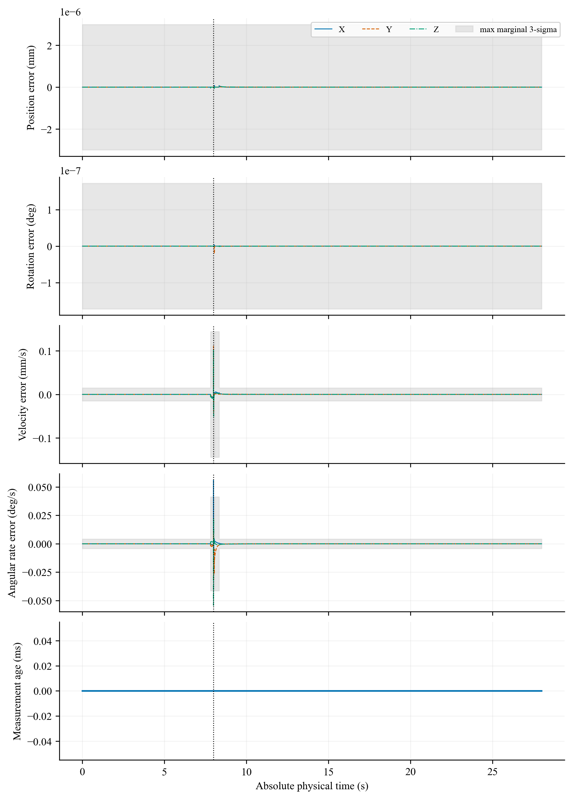
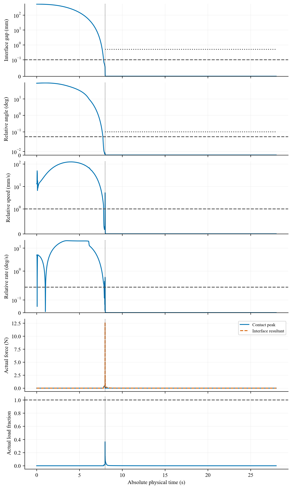
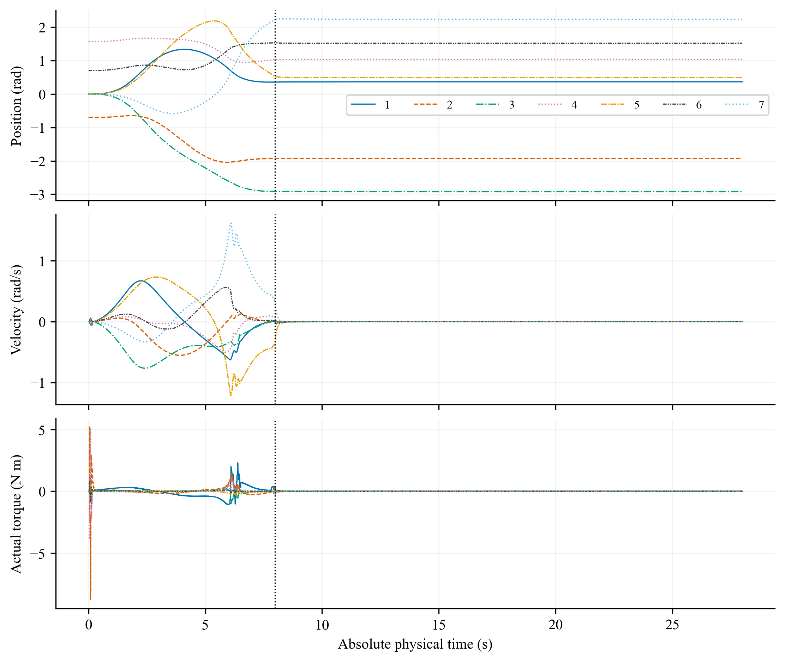
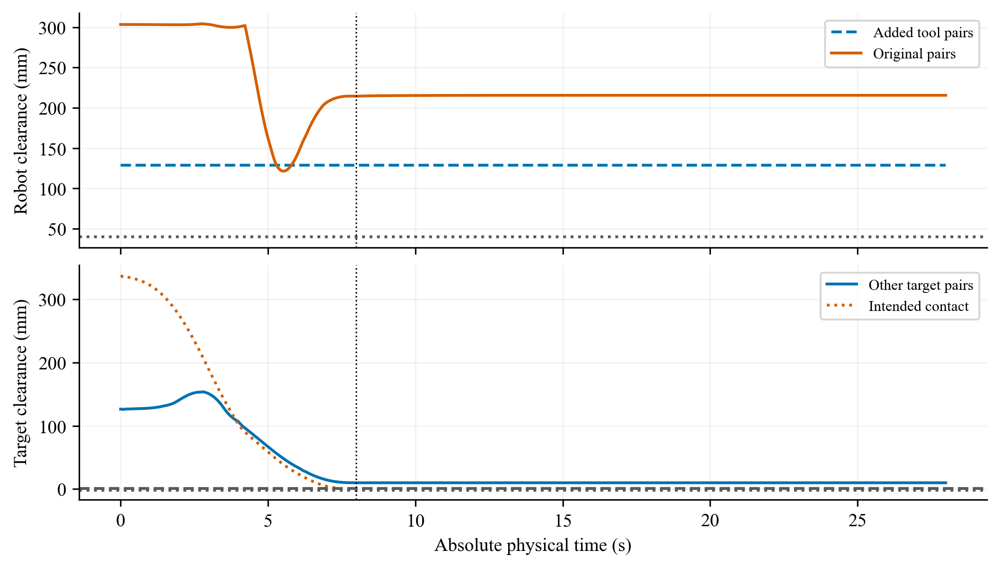

# N209 当前可视化

**PARTIAL_OPERATING_DOMAIN_MISMATCH**。全部 8 条已见尝试：3 条完成、5 条早停；独立盲测、消融及细步长未准入。

视频选取最终 V2 名义回归 `R01_V2_nominal`，从 t=0 连续展示到 27.992 s，7.992 s 锁紧。画面是已验证 trace 的显示，不是新仿真或新的性能证据。

[交互式本地图集](index.html)（下载并执行 `git lfs pull hybrid` 后在浏览器打开） · [刷新清单](refresh_manifest.json) · [视频来源](video_manifest.json) · [完整报告](../../../../paper/N209_FEASIBILITY_AND_UNCERTAINTY_REPORT.md)

## 同步视频

GitHub 文件页可下载 MP4；HTML 视频播放需本地打开图集。合成总览为 2880 × 1200，请全屏或按原始尺寸读取面板中的数值。

- [五个固定视角与连续体侧合成总览](overview_five_views_and_body_side.mp4)
- [独立连续基座体侧视角](body_side.mp4)
- [接口近景](interface_closeup.mp4)
- 独立固定镜头：[等轴](isometric.mp4) · [正面](front.mp4) · [右侧](right.mp4) · [俯视](top.mp4) · [后方](rear.mp4)


## 全部运行

每条记录有 11 类诊断图，均提供 PNG 和矢量 PDF。早停运行在实际时间终止，缺失抓后窗标为 NOT_EVALUATED。

|运行|结果|实际结束 (s)|可视化|
|---|---|---|---|
| [D01_V1_nominal](runs/D01_V1_nominal/README.md) | COMPLETED | 27.992 | [跟踪误差](runs/D01_V1_nominal/tracking.png) · [全部图表](runs/D01_V1_nominal/README.md) |
| [D02_V1_H2](runs/D02_V1_H2/README.md) | NO_VERIFIED_CONTROL | 0.040 | [跟踪误差](runs/D02_V1_H2/tracking.png) · [全部图表](runs/D02_V1_H2/README.md) |
| [D03_V1_S01](runs/D03_V1_S01/README.md) | NO_VERIFIED_CONTROL | 7.840 | [跟踪误差](runs/D03_V1_S01/tracking.png) · [全部图表](runs/D03_V1_S01/README.md) |
| [D04_V2_H2](runs/D04_V2_H2/README.md) | NO_VERIFIED_CONTROL | 5.900 | [跟踪误差](runs/D04_V2_H2/tracking.png) · [全部图表](runs/D04_V2_H2/README.md) |
| [R01_V2_nominal](runs/R01_V2_nominal/README.md) | COMPLETED | 27.992 | [跟踪误差](runs/R01_V2_nominal/tracking.png) · [全部图表](runs/R01_V2_nominal/README.md) |
| [R02_V2_H2](runs/R02_V2_H2/README.md) | NO_VERIFIED_CONTROL | 5.900 | [跟踪误差](runs/R02_V2_H2/tracking.png) · [全部图表](runs/R02_V2_H2/README.md) |
| [R03_V2_S01](runs/R03_V2_S01/README.md) | NO_VERIFIED_CONTROL | 7.840 | [跟踪误差](runs/R03_V2_S01/tracking.png) · [全部图表](runs/R03_V2_S01/README.md) |
| [R04_V2_H1](runs/R04_V2_H1/README.md) | COMPLETED | 27.932 | [跟踪误差](runs/R04_V2_H1/tracking.png) · [全部图表](runs/R04_V2_H1/README.md) |

## 当前名义回归的完整诊断图

### 末端实际与参考轨迹

[矢量 PDF](trajectory.pdf) · [全部运行中的对应图](runs/R01_V2_nominal/trajectory.png)


### 末端轨迹跟踪误差

[矢量 PDF](tracking.pdf) · [全部运行中的对应图](runs/R01_V2_nominal/tracking.png)


### 参考进度与治理候选

[矢量 PDF](reference_progress.pdf) · [全部运行中的对应图](runs/R01_V2_nominal/reference_progress.png)


### 状态估计误差与测量年龄

[矢量 PDF](state_estimation.pdf) · [全部运行中的对应图](runs/R01_V2_nominal/state_estimation.png)



### 实际捕获量与接口载荷

[矢量 PDF](capture_and_load.pdf) · [全部运行中的对应图](runs/R01_V2_nominal/capture_and_load.png)



### 世界与相对角速度

[矢量 PDF](detumbling.pdf) · [全部运行中的对应图](runs/R01_V2_nominal/detumbling.png)


### 动量、能量与功

[矢量 PDF](momentum_energy.pdf) · [全部运行中的对应图](runs/R01_V2_nominal/momentum_energy.png)


### 七关节状态与实际力矩

[矢量 PDF](joints.pdf) · [全部运行中的对应图](runs/R01_V2_nominal/joints.png)



### 碰撞距离与接口几何

[矢量 PDF](geometry.pdf) · [全部运行中的对应图](runs/R01_V2_nominal/geometry.png)



### 影子惯性辨识

[矢量 PDF](identification.pdf) · [全部运行中的对应图](runs/R01_V2_nominal/identification.png)


### 被动基座漂移与角速度

[矢量 PDF](base_motion.pdf) · [全部运行中的对应图](runs/R01_V2_nominal/base_motion.png)


## 复现与发布范围

```powershell
python -m v6_mujoco.feasible_capture --visualize
python tools/n209_visualization_delivery.py
```

`--visualize --resume` 重建图表，并在核对 trace、渲染器和视频哈希后复用已有视频。原始实验、失败记录、审计输入和历史 N208 图均保留。

本次按用户新授权发布当前 S00 版本及完整可视化，发布分支 `codex/system-s00-visual-refresh`，S00 验收快照 `80ac0f69faa258cba61a2623a4f55961e7ffbebb`。S00 报告与 handoff 的“本地提交、不推送”描述验收快照产生时的范围；本次发布记录在 refresh_manifest.json。图表与视频由原 N209 trace 重新生成，S00 未产生新物理轨迹；未启动 S01—S08、未合并主分支。S00 验收复现应检出其快照提交，避免把后续媒体刷新当作验收时的文件状态。

[显示质量复核](visual_quality_review.md) · [完整解码及文件核验](visualization_audit.json)
