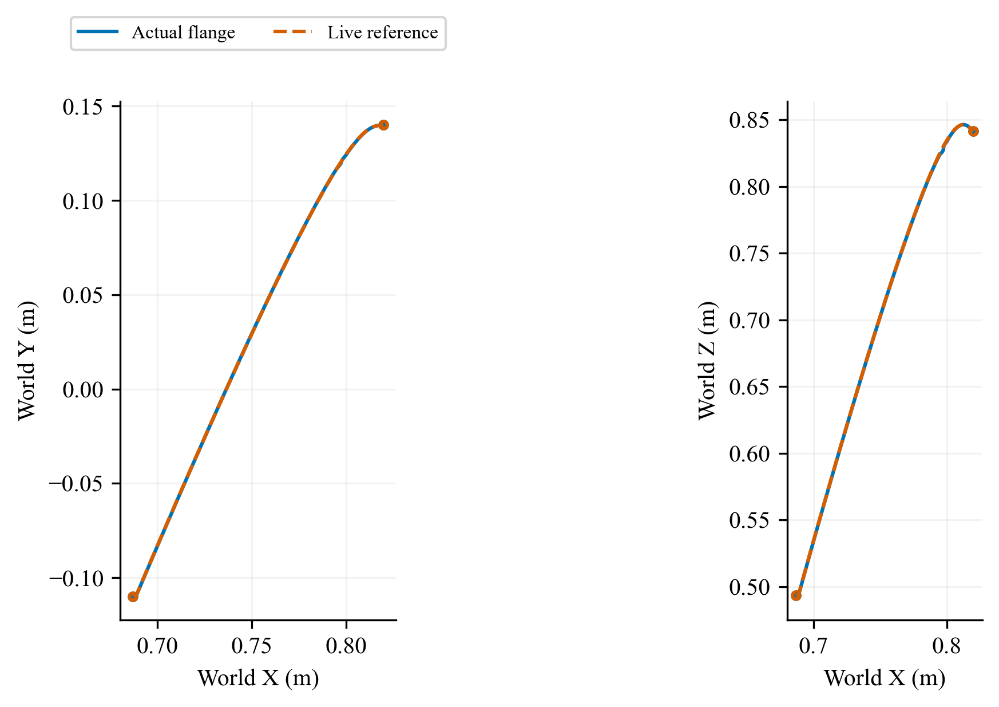
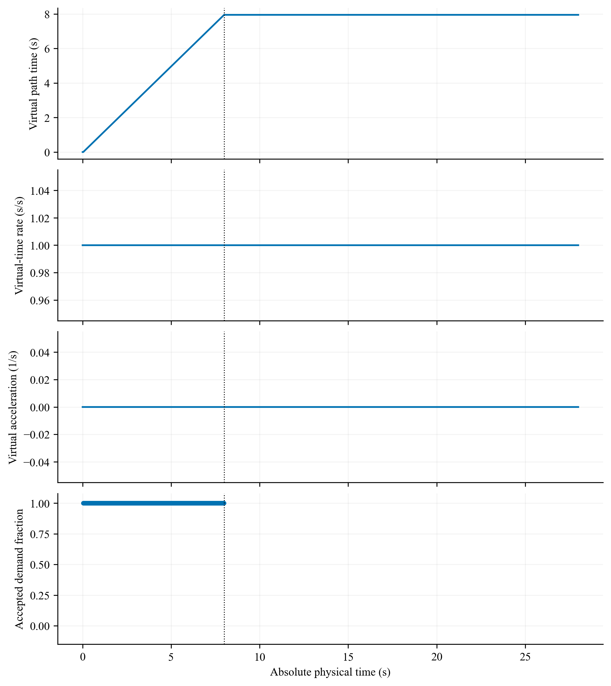
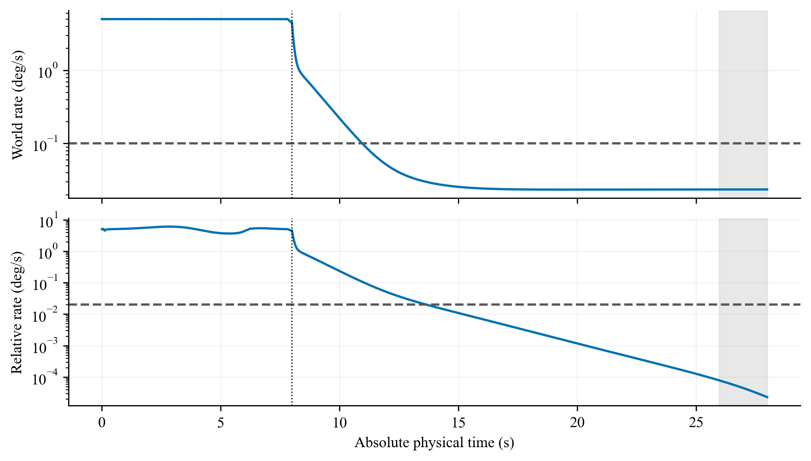
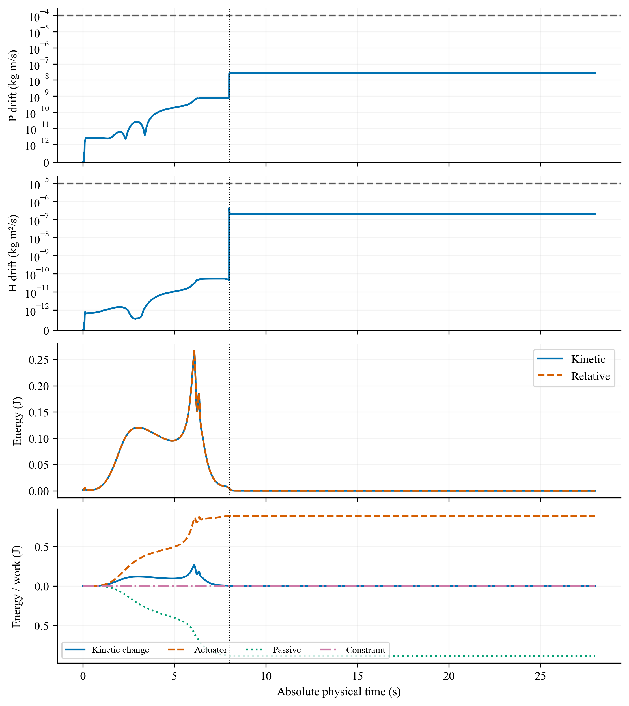
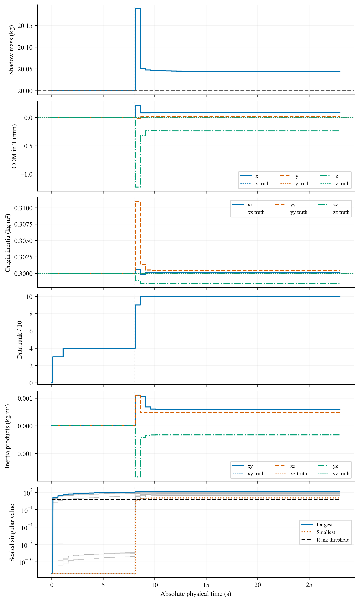
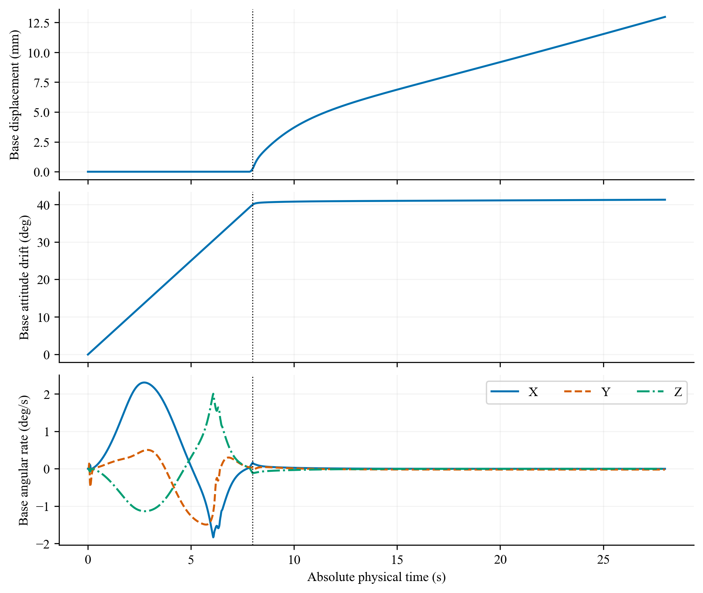

# D01_V1_nominal 可视化

[返回全部运行](../../README.md) · [本地 HTML 图集](index.html)

结果：COMPLETED；实际结束 27.992 s；末段窗口：EVALUATED。

## 末端实际与参考轨迹

[矢量 PDF](trajectory.pdf)

World XY/XZ paths of the actual flange and the recorded live reference, only while the approach reference is applicable. Equal spatial scales. Run D01_V1_nominal; COMPLETED; actual interval 0.000–27.992 s; latch 7.992 s; final window EVALUATED. All runs are seen development/regression.

## 末端轨迹跟踪误差

[矢量 PDF](tracking.pdf)

Actual flange minus the recorded live reference during approach: world position components, position norm, and SO(3) rotation error. No inactive post-latch reference is extended. Run D01_V1_nominal; COMPLETED; actual interval 0.000–27.992 s; latch 7.992 s; final window EVALUATED. All runs are seen development/regression.

## 参考进度与治理候选

[矢量 PDF](reference_progress.pdf)

Virtual path time in seconds, virtual-time rate, acceleration and selected candidate. A red x means no verified candidate, not an accepted zero-speed command. Run D01_V1_nominal; COMPLETED; actual interval 0.000–27.992 s; latch 7.992 s; final window EVALUATED. All runs are seen development/regression.

## 状态估计误差与测量年龄

[矢量 PDF](state_estimation.pdf)

Geometric-origin estimation errors at valid estimator-output ticks. Shading is the maximum of three marginal 3-sigma values, not joint coverage or a safety certificate. Run D01_V1_nominal; COMPLETED; actual interval 0.000–27.992 s; latch 7.992 s; final window EVALUATED. All runs are seen development/regression.

## 实际捕获量与接口载荷

[矢量 PDF](capture_and_load.pdf)

Independent physical capture quantities and actual load. Dashed pose lines denote capture gates; dotted post-latch lines denote holding gates. Values are not corrected by subtracting numerical residuals. Run D01_V1_nominal; COMPLETED; actual interval 0.000–27.992 s; latch 7.992 s; final window EVALUATED. All runs are seen development/regression.

## 世界与相对角速度

[矢量 PDF](detumbling.pdf)

Target world and target-base relative angular-speed norms. The fixed final two-second window is shaded only for completed full-horizon runs. Run D01_V1_nominal; COMPLETED; actual interval 0.000–27.992 s; latch 7.992 s; final window EVALUATED. All runs are seen development/regression.

## 动量、能量与功

[矢量 PDF](momentum_energy.pdf)

Separate linear/angular momentum drift, kinetic/relative energy and integrated work. Momentum and actual safety quantities retain their original SI definitions. Run D01_V1_nominal; COMPLETED; actual interval 0.000–27.992 s; latch 7.992 s; final window EVALUATED. All runs are seen development/regression.

## 七关节状态与实际力矩

[矢量 PDF](joints.pdf)

All seven joint positions, velocities and actual actuator forces from the saved physical trajectory. Line style and color identify each joint. Run D01_V1_nominal; COMPLETED; actual interval 0.000–27.992 s; latch 7.992 s; final window EVALUATED. All runs are seen development/regression.

## 碰撞距离与接口几何

[矢量 PDF](geometry.pdf)

Original and added robot-clearance pairs, other target pairs and intended interface contact are shown with their separate original thresholds. Run D01_V1_nominal; COMPLETED; actual interval 0.000–27.992 s; latch 7.992 s; final window EVALUATED. All runs are seen development/regression.

## 影子惯性辨识

[矢量 PDF](identification.pdf)

Shadow posterior parameters and finite-data rank; evaluation-only truth is dashed in the matching component color. The logarithmic singular-value display floors values below 1e-12; this floor is not measured excitation. Parameter feedback remains disabled. Numerical rank is not parameter accuracy or control benefit. Run D01_V1_nominal; COMPLETED; actual interval 0.000–27.992 s; latch 7.992 s; final window EVALUATED. All runs are seen development/regression.

## 被动基座漂移与角速度

[矢量 PDF](base_motion.pdf)

Passive-base translation and geodesic attitude change relative to its initial pose, followed by world angular-velocity components. No base actuator is introduced. Run D01_V1_nominal; COMPLETED; actual interval 0.000–27.992 s; latch 7.992 s; final window EVALUATED. All runs are seen development/regression.
