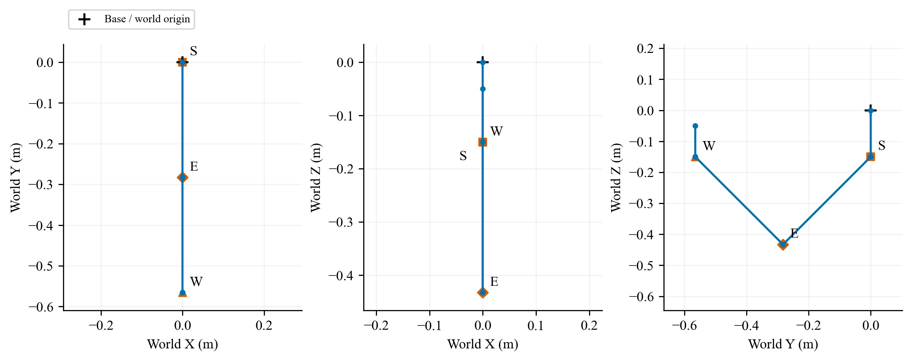
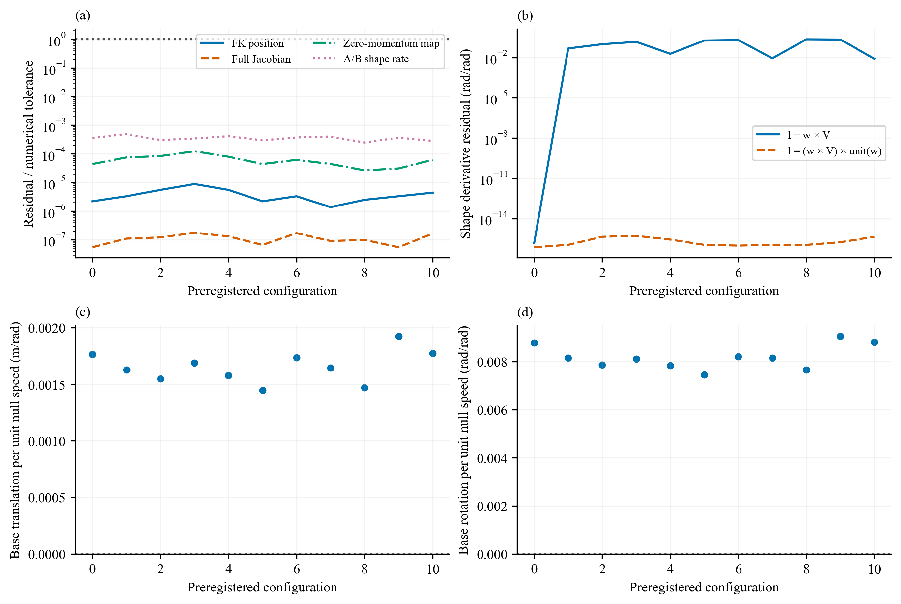
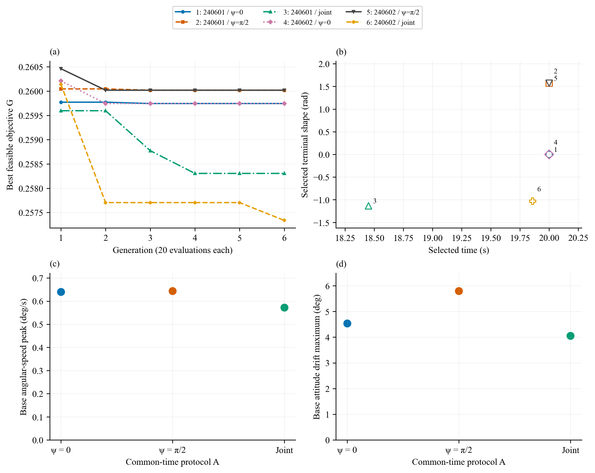

# S01 四组核心图

仅接触前 SRS；来源限制与失败保留。

## SRS 模型与坐标

[PDF](model_and_frames.pdf)

Initial SRS centerlines in three world-coordinate projections, from the published DH table and separately recorded joint angles. S, E and W denote shoulder, elbow and wrist. The DH0 mount is the declared Rx(pi) assumption; initial base and world frames coincide. Graphics are schematic, not collision envelopes or mass-support geometry. Published masses total 524 kg; link COMs and inertia axes require declared assumptions.

## 数学核验与层级残差

[PDF](mathematics_and_hierarchy.pdf)

Eleven preregistered configurations: index 0 is the initial state, and indices 1-10 follow the fixed sine-perturbation rule in s01.json. (a) Each residual is normalized by its corresponding numerical tolerance; unity is the acceptance boundary. FK position is maximum component error (tolerance 1e-10 m); full Jacobian is maximum entry error (1e-8 in the stated mixed linear/angular coordinates); zero-momentum map is maximum entry residual (1e-10 in its stated SI coordinates); A/B shape rate is absolute difference (1e-6 rad/s). (b) Eq. (23) under two readings of its undefined vector l, versus the independent derivative of Eq. (18). (c,d) Translational and angular base motion per unit nullspace speed, shown separately with zero as the reactionless reference. Values below 1e-17 in logarithmic displays are plotted at 1e-17, a display floor only.

## 优化与基座扰动比较

[PDF](optimization_and_base_comparison.pdf)

Three strategies (fixed shape 0, fixed shape pi/2, and joint time/shape optimization) and two fixed seeds (240601,240602) receive 120 kinematic evaluations each. G is squared world base angular-speed peak normalized by 5 deg/s plus squared grasp-direction alignment normalized by pi, with weights 1/1; definitions and gates are frozen in assumptions.yaml. (a) Feasible-only best objective by generation; gaps mean no feasible incumbent. (b) Selected time and shape; numbers refer to the legend, with a gray x for an infeasible candidate. (c,d) Actual dynamic base angular-speed peaks and attitude drift for the common-time protocol A. An x denotes an unqualified trajectory, annotated with its actual end time; its statistic uses that recorded interval only and is not an admissible benefit comparison. Two seeds provide descriptive results only; reduced-budget stagnation does not establish convergence. Protocol A uses the joint result of seed 240601 by the preregistered rule, independent of which seed has the lower objective. Qualification covers the declared inertial model and gates, not physical collision clearance or contact. Common time = 18.451817 s. psi0: COMPLETED, qualified=True; psi90: COMPLETED, qualified=True; joint: COMPLETED, qualified=True.

## 实际轨迹跟踪与动力学

[PDF](tracking_and_dynamics.pdf)

Actual torque-driven SRS traces at the author-reported point (15.6 s, 0.2686 rad; source-nullspace and adapted HQP) and at the preregistered common-time joint result. Position, rotation and shape errors, world base speed, separate P/H drift about the fixed world origin, actual applied torque and actual joint speed are shown. Curves end at the true stopping time: x marks an unqualified run and a circle a qualified run. Horizontal dotted lines are frozen path gates (5 mm, 1 deg, 2 deg), P/H drift gates (1e-6 kg m/s and 1e-6 kg m²/s), and torque/joint-speed limits (50 N m, 0.8 rad/s). There is no fabricated terminal segment. Plotted failed trajectories do not establish source reproduction. Qualification covers the declared inertial model and gates, not physical collision clearance or contact. Author / source: JOINT_VELOCITY_COMMAND_LIMIT, end=6.120000 s; Author / HQP: ACTUAL_JOINT_VELOCITY_LIMIT, end=7.120000 s; Common / joint: COMPLETED, end=18.451817 s.
