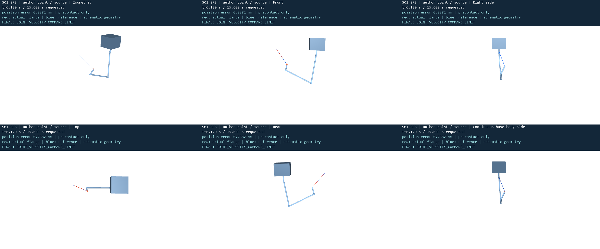

# S01 作者报告点视频

[五个固定视角与连续体侧合成视频](srs_author_point_five_views_and_body_side.mp4)

运行 C2_author_point_source，JOINT_VELOCITY_COMMAND_LIMIT。仅到实际停止时刻 6.120 s；要求时域 15.6 s 未完成。中心线为示意，视频不代表接触或完整捕获。全部画面来自同一真实积分记录；显示过程不推进动力学。连续体侧指随基座连续旋转的镜头。
