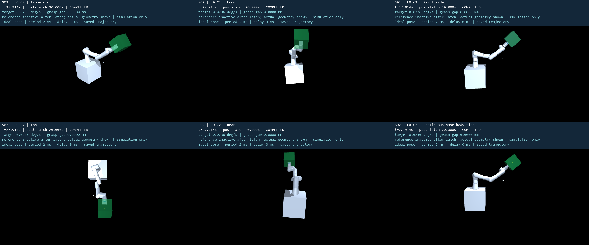
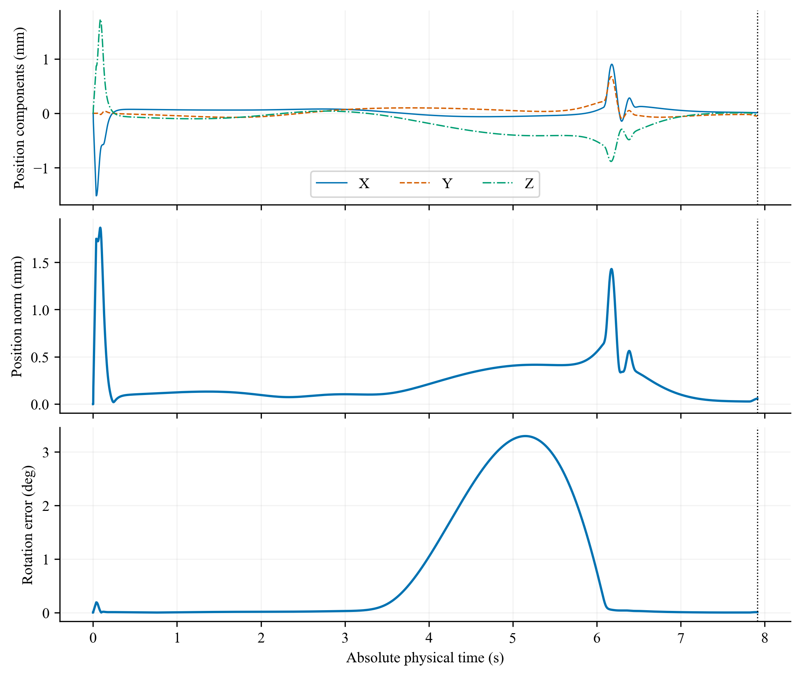

# S02 当前版本完整可视化

S02：ACCURACY_IMPROVED_GUARD_NOT_COMPATIBLE。E0_C2 完成完整捕获与抓后消旋；原 E0 实现失败、E1/E2 噪声条件控制拒绝均保留，E3 未运行。估计 RMS 改善不等于噪声捕获合格，启动峰值反而变大。

[本地交互图集](index.html) · [实验报告](../report.md) · [媒体清单](refresh_manifest.json) · [核验](visualization_audit.json)

全部媒体读取保存的实际轨迹，显示过程不推进动力学。五个固定世界镜头、连续随基座姿态旋转的体侧镜头及接口近景采用相同时间索引；30 fps 原速，末帧为实际停止状态，视频封装时长最多增加两个帧周期。体侧是相机定义，不是柔性连续体机器人。合成分辨率 2880×1200，独立镜头 960×600。

## 完整名义任务 E0_C2

锁紧7.914 s，实际结束27.914 s。

- [五视角与连续体侧合成总览](runs/E0_C2/overview_five_views_and_body_side.mp4)
- [连续基座体侧](runs/E0_C2/body_side.mp4)
- [接口近景](runs/E0_C2/interface_closeup.mp4)
- [等轴](runs/E0_C2/isometric.mp4)
- [正面](runs/E0_C2/front.mp4)
- [右侧](runs/E0_C2/right.mp4)
- [俯视](runs/E0_C2/top.mp4)
- [后方](runs/E0_C2/rear.mp4)



## 全部运行：44组诊断图与32个视频

|运行|结果|实际结束(s)|抓后末窗|
|---|---|---|---|
| [E0](runs/E0/README.md) | IMPLEMENTATION_ERROR | 7.814 | NOT_EVALUATED |
| [E0_C2](runs/E0_C2/README.md) | COMPLETED | 27.914 | 已评价 |
| [E1](runs/E1/README.md) | NO_VERIFIED_CONTROL | 8.020 | NOT_EVALUATED |
| [E2](runs/E2/README.md) | NO_VERIFIED_CONTROL | 8.820 | NOT_EVALUATED |

E3未运行。每条运行11类图均有PNG与矢量PDF；失败记录只显示实际前缀。

## 末端轨迹与跟踪误差

[实际/参考轨迹](runs/E0_C2/trajectory.png) · [轨迹PDF](runs/E0_C2/trajectory.pdf) · [误差PDF](runs/E0_C2/tracking.pdf)



位置误差为实际法兰减有效法兰参考，姿态误差采用SO(3)；参考在锁紧后停用，抓后接口保持量在capture_and_load中单独显示。

## 四组科学主图

[全部科学主图及严格图注](core_figures/README.md)

## 复现与来源

```powershell
python tools/s02_refresh_media.py --plots
python tools/s02_refresh_media.py --videos
python tools/s02_media_delivery.py
```

发布分支 `codex/system-s02-estimation-capture-contract`。本次按用户新增授权刷新媒体并上传 GitHub；原实验验收快照为 `7198178ad798624f6ea163244e03641b78a56a3c`，其报告、handoff、原始数据及资源账本保持原样。原文“未推送”描述验收快照产生时的状态。此显示工作单独记账，不是新物理实验。

克隆后执行 `git lfs pull` 获取轨迹和视频，然后在本地打开 index.html。GitHub Markdown 可预览PNG，MP4通过文件页下载。

[显示复核](visual_quality_review.md) · [历史S01](../../S01/visualizations/README.md) · [历史N209](../../../n209_paper_system/visualizations/README.md)
