# E1

[返回全部结果](../../README.md) · [本地交互图集](index.html)

E1：NO_VERIFIED_CONTROL；实际结束 8.020 s；抓后末窗 NOT_EVALUATED。

[五视角与连续体侧合成总览](overview_five_views_and_body_side.mp4) · [连续基座体侧](body_side.mp4) · [接口近景](interface_closeup.mp4) · [等轴](isometric.mp4) · [正面](front.mp4) · [右侧](right.mp4) · [俯视](top.mp4) · [后方](rear.mp4)

## 末端实际与参考轨迹

[PDF](trajectory.pdf)

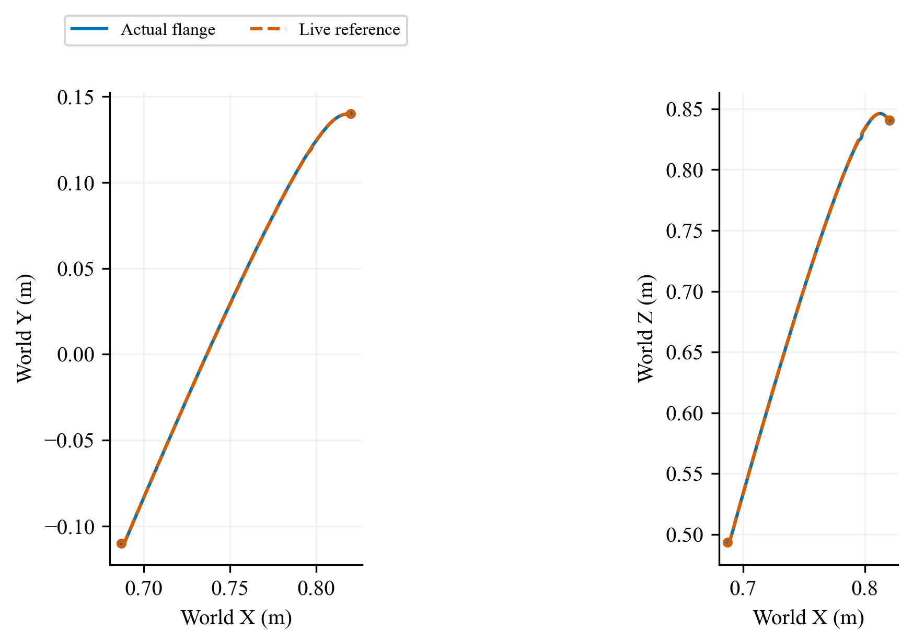

World XY/XZ paths of the actual flange and the recorded observer-evaluated approach reference, only while the approach reference is applicable. Equal spatial scales. Run E1; NO_VERIFIED_CONTROL; actual interval 0.000–8.020 s; latch none; final window NOT_EVALUATED (full post-capture horizon absent). All attempts, including the original implementation failure, are retained. S02 does not establish noisy capture compatibility.

## 末端轨迹跟踪误差

[PDF](tracking.pdf)

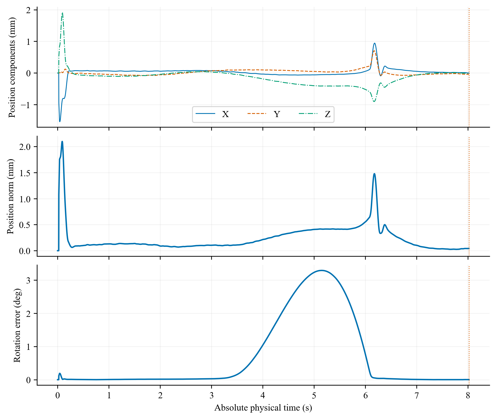

Actual flange minus the recorded observer-evaluated approach reference during approach: world position components, position norm, and SO(3) rotation error. No inactive post-latch reference is extended. This observer-sampled reference is not a freshly issued HQP task command at every servo tick. The E0 terminal point at 7.814 s uses the retained reference state before the failed update. Run E1; NO_VERIFIED_CONTROL; actual interval 0.000–8.020 s; latch none; final window NOT_EVALUATED (full post-capture horizon absent). All attempts, including the original implementation failure, are retained. S02 does not establish noisy capture compatibility.

## 参考进度与治理候选

[PDF](reference_progress.pdf)

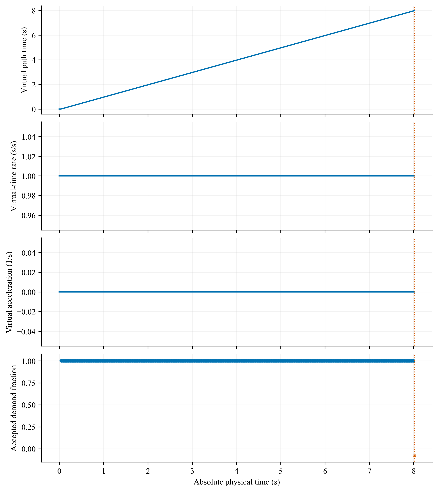

Virtual path time in seconds, virtual-time rate, acceleration and selected candidate. A red x means no verified candidate, not an accepted zero-speed command. Run E1; NO_VERIFIED_CONTROL; actual interval 0.000–8.020 s; latch none; final window NOT_EVALUATED (full post-capture horizon absent). All attempts, including the original implementation failure, are retained. S02 does not establish noisy capture compatibility.

## 状态估计误差与测量年龄

[PDF](state_estimation.pdf)

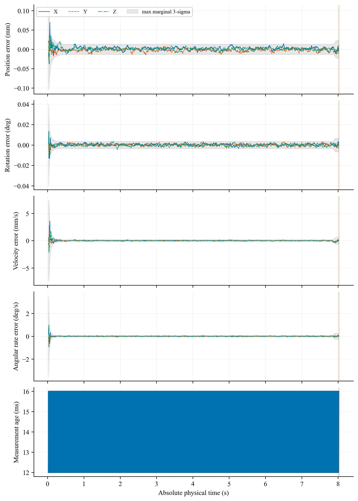

Initialization ticks without a valid estimate and stale terminal estimates are excluded here; core F1 retains initialization for historical R03 only, not for these current runs. Geometric-origin estimation errors at valid estimator-output ticks. Shading is the maximum of three marginal 3-sigma values, not joint coverage or a safety certificate. Run E1; NO_VERIFIED_CONTROL; actual interval 0.000–8.020 s; latch none; final window NOT_EVALUATED (full post-capture horizon absent). All attempts, including the original implementation failure, are retained. S02 does not establish noisy capture compatibility.

## 实际捕获量与接口载荷

[PDF](capture_and_load.pdf)

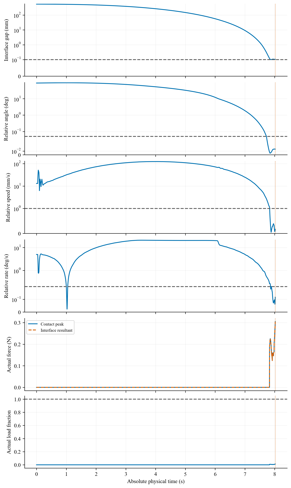

Independent physical capture quantities and actual load. Dashed pose lines denote capture gates; dotted post-latch lines denote holding gates. Values are not corrected by subtracting numerical residuals. Run E1; NO_VERIFIED_CONTROL; actual interval 0.000–8.020 s; latch none; final window NOT_EVALUATED (full post-capture horizon absent). All attempts, including the original implementation failure, are retained. S02 does not establish noisy capture compatibility.

## 世界与相对角速度

[PDF](detumbling.pdf)

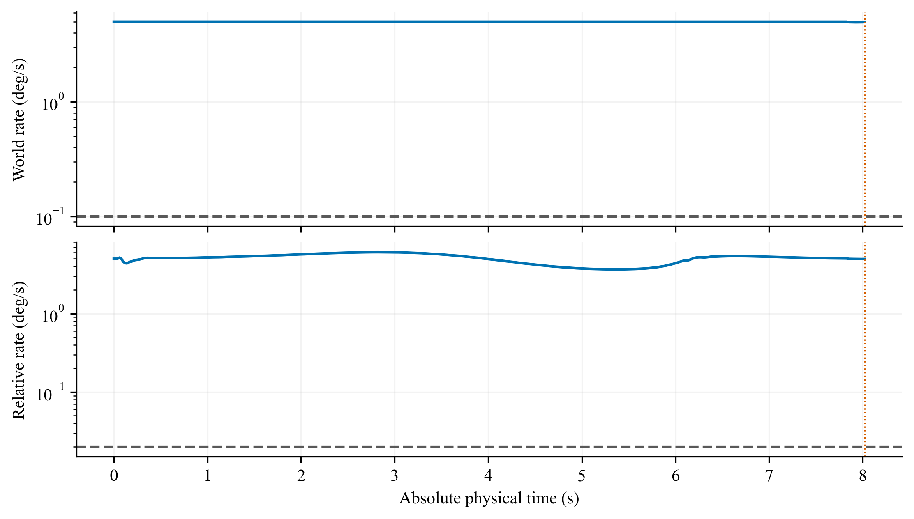

Target world and target-base relative angular-speed norms. The fixed final two-second window is shaded only for completed full-horizon runs. Run E1; NO_VERIFIED_CONTROL; actual interval 0.000–8.020 s; latch none; final window NOT_EVALUATED (full post-capture horizon absent). All attempts, including the original implementation failure, are retained. S02 does not establish noisy capture compatibility.

## 动量、能量与功

[PDF](momentum_energy.pdf)

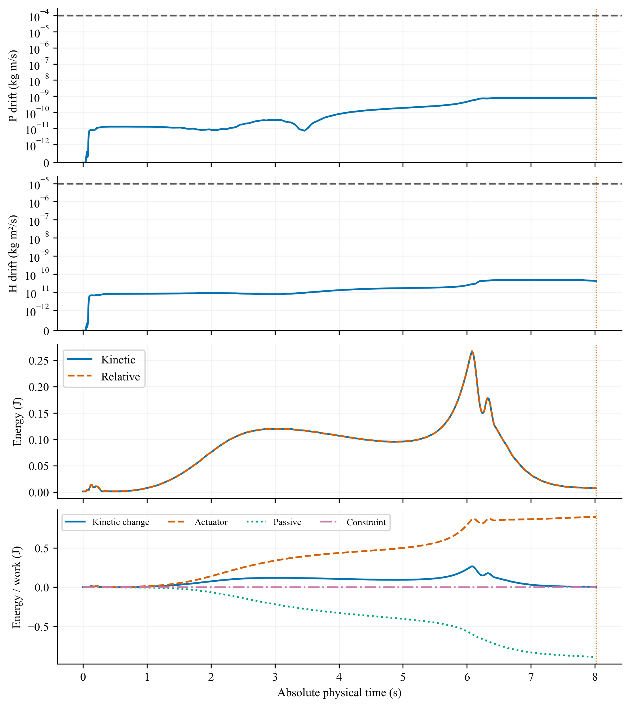

Separate linear/angular momentum drift, kinetic/relative energy and integrated work. Momentum and actual safety quantities retain their original SI definitions. Run E1; NO_VERIFIED_CONTROL; actual interval 0.000–8.020 s; latch none; final window NOT_EVALUATED (full post-capture horizon absent). All attempts, including the original implementation failure, are retained. S02 does not establish noisy capture compatibility.

## 七关节状态与实际力矩

[PDF](joints.pdf)

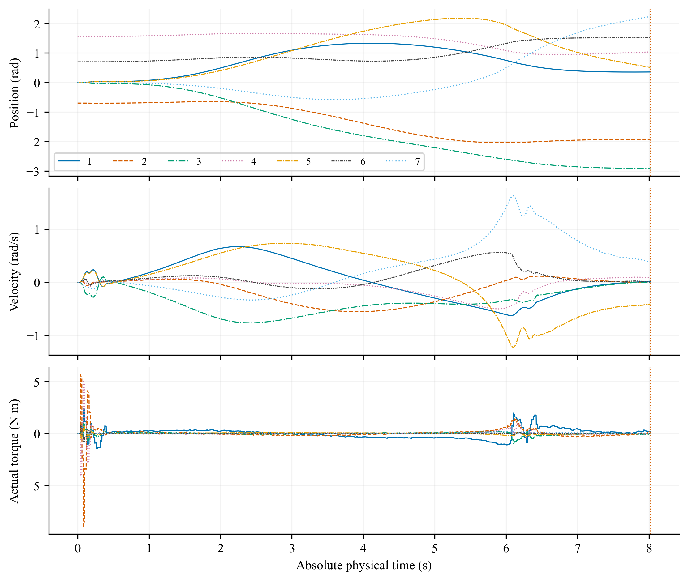

All seven joint positions, velocities and actual actuator forces from the saved physical trajectory. Line style and color identify each joint. Run E1; NO_VERIFIED_CONTROL; actual interval 0.000–8.020 s; latch none; final window NOT_EVALUATED (full post-capture horizon absent). All attempts, including the original implementation failure, are retained. S02 does not establish noisy capture compatibility.

## 碰撞距离与接口几何

[PDF](geometry.pdf)

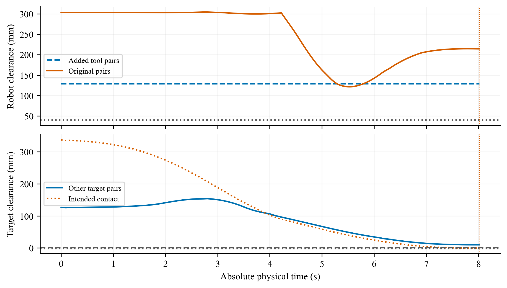

Original and added robot-clearance pairs, other target pairs and intended interface contact are shown with their separate original thresholds. Run E1; NO_VERIFIED_CONTROL; actual interval 0.000–8.020 s; latch none; final window NOT_EVALUATED (full post-capture horizon absent). All attempts, including the original implementation failure, are retained. S02 does not establish noisy capture compatibility.

## 影子惯性辨识

[PDF](identification.pdf)

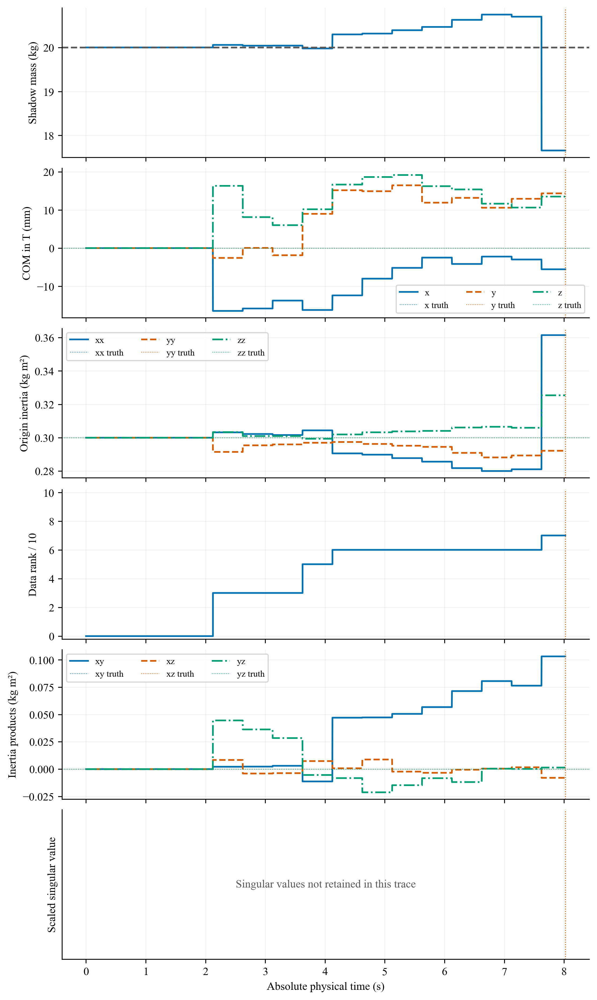

Saved shadow parameter and rank diagnostics; singular-value series was not persisted in S02 and its panel is explicitly unavailable; evaluation-only truth is dashed in the matching component color. Parameter feedback remains disabled. Numerical rank is not parameter accuracy or control benefit. Run E1; NO_VERIFIED_CONTROL; actual interval 0.000–8.020 s; latch none; final window NOT_EVALUATED (full post-capture horizon absent). All attempts, including the original implementation failure, are retained. S02 does not establish noisy capture compatibility.

## 被动基座漂移与角速度

[PDF](base_motion.pdf)

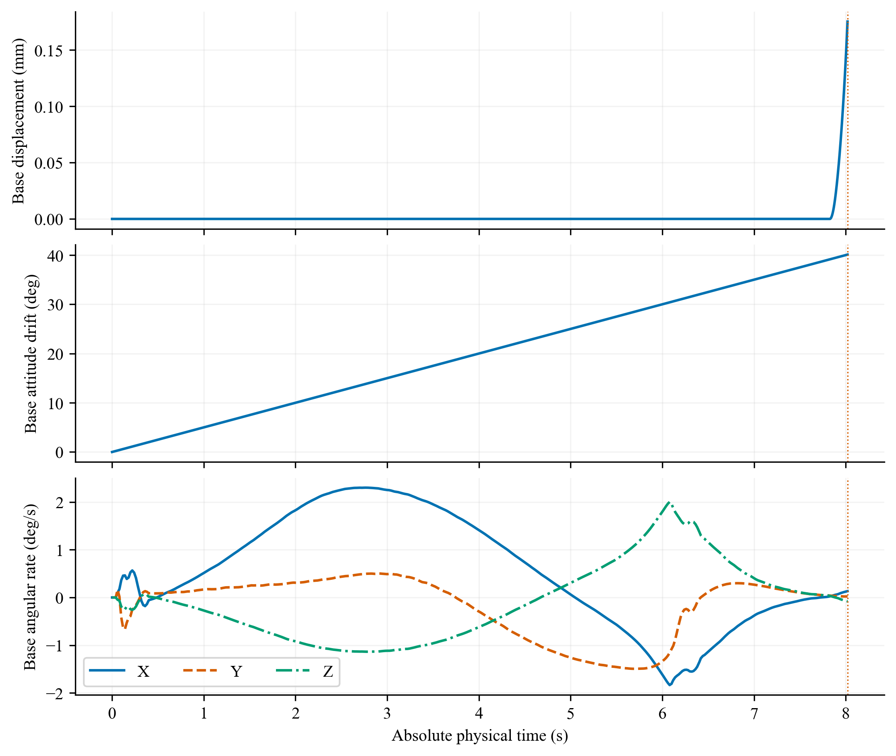

Passive-base translation and geodesic attitude change relative to its initial pose, followed by world angular-velocity components. No base actuator is introduced. Run E1; NO_VERIFIED_CONTROL; actual interval 0.000–8.020 s; latch none; final window NOT_EVALUATED (full post-capture horizon absent). All attempts, including the original implementation failure, are retained. S02 does not establish noisy capture compatibility.
