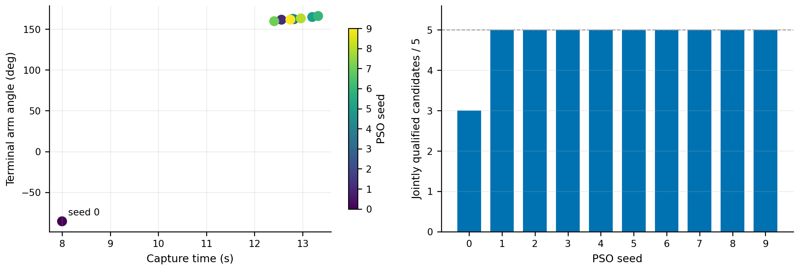
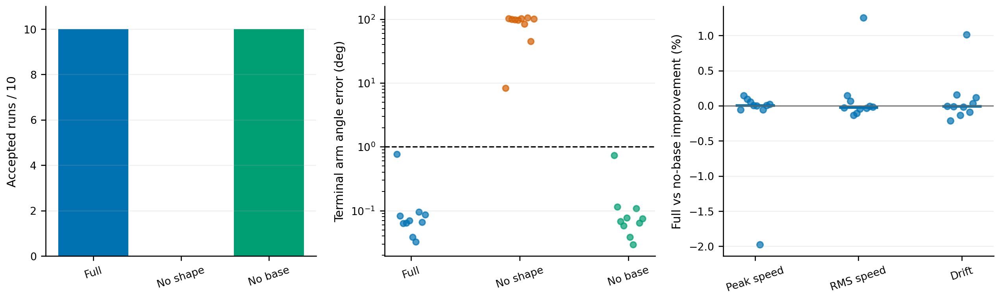
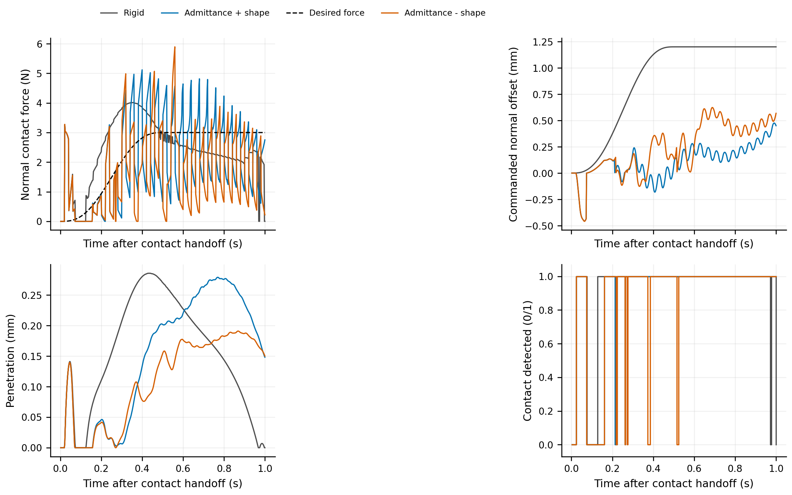
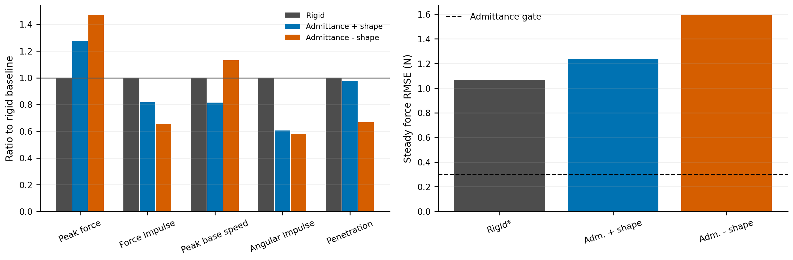

# 最新实验结果图集（2026-09-24）

本图集读取当前场景的正式或补充输出：N055R、N061、N070–N073、N100–N104。所有图像提供可缩放的 PDF 与预览 PNG。数值图由同目录的 `fig_*.py` 从原始 JSON/NPZ 重新生成；视频从已保存轨迹渲染，未重新运行控制器或改变实验结果。

## 1. 接触前优化与对照

| 图 | 内容 | 数据范围 | 解释边界 |
|---|---|---|---|
| [01 正式搜索](01_n055r_search_and_qualification.pdf) | 10 个 seed 的捕获时间、终端臂形和每 seed 合格候选数 | N055R 正式 PSO 与 50 条候选 | 10/10 seeds、48/50 candidates 联合合格 |
| [02 权重敏感性](02_n061_weight_sensitivity.pdf) | 三组权重下每 seed 的未加权代价、基座峰值角速度和最小间距 | N061，三组各 10 个合格动态选择 | 横线为均值；不同权重的加权目标值不直接比较 |
| [03 同时间固定角](03_n070_fixed_time_diagnostic.pdf) | 优化臂形与固定 0°、90° 的终端误差和基座角速度 | N070，统一 8 s | 固定角未通过捕获验收，基座数值不用于合格方法间的改善率 |
| [04 固定角可达性](04_n071_n072_sampled_reachability.pdf) | 位置/臂形误差二维采样分布；虚线为规划门 | N071 171 点、N072 324 个去重时间点 | 采样诊断；不证明连续时间域不可行 |
| [05 控制器消融](05_n073_ablation_all_seeds.pdf) | 三变体合格数、终端臂形误差及完整方法对去基座项的配对差 | N073，10 seeds × 3 | 去臂形 0/10；去基座项 10/10，但基座收益不显著 |
| [06 接触前轨迹](06_n073_seed00_precontact_trace.pdf) | 位置、臂形、基座角速度和间距随时间变化 | N073 seed 00 三变体 | 仅作轨迹例子；整体结论以图 05 的 10 seeds 为准 |

### 接触前运动视频

同一 seed 00 冻结轨迹、同一视角；每段 8.07 s，640×480、15 fps。各目录的 `visualization_manifest.json` 校验了源轨迹哈希、帧数及视频时长。

| 变体 | 视频 | 起点/中点/终点 |
|---|---|---|
| 完整控制器 | [MP4](motion_full/selected_capture_isometric.mp4) · [GIF](motion_full/selected_capture_isometric.gif) | [故事板](motion_full/selected_capture_storyboard.png) |
| 去臂形 | [MP4](motion_no_shape/selected_capture_isometric.mp4) · [GIF](motion_no_shape/selected_capture_isometric.gif) | [故事板](motion_no_shape/selected_capture_storyboard.png) |
| 去基座反作用 | [MP4](motion_no_base_reaction/selected_capture_isometric.mp4) · [GIF](motion_no_base_reaction/selected_capture_isometric.gif) | [故事板](motion_no_base_reaction/selected_capture_storyboard.png) |

## 2. 物理接触与力控制

| 图 | 内容 | 数据范围 | 解释边界 |
|---|---|---|---|
| [07 接触预检](07_n100_n101_contact_prechecks.pdf) | 支撑力及临界阻尼阶跃的解析重建 | N100/N101 预检 JSON | 右侧曲线由报告参数解析重建，不是保存的仿真时序 |
| [08 接触时序](08_n102_n104_contact_time_series.pdf) | 法向力、指令偏移、穿透、接触状态 | N102/N103/N104 三条权威 NPZ | 一次 seed 00、1 s 单边接触瞬态 |
| [09 接触指标](09_n102_n104_contact_metrics.pdf) | 峰值力、冲量、基座扰动、穿透及稳态力误差 | N102–N104 权威比较 JSON | 刚性组 RMSE 仅为描述值，不适用导纳力跟踪门；N103/N104 都未通过该门 |

### 接触运动视频

三段均从 N073 seed 00 完整控制器交接状态出发，采用同一物理模型；每段 1 s，640×480、15 fps。渲染时核对了源产物哈希、模型身份、独立重放状态及视频帧数。

| 方法 | 视频 | 起点/中点/终点 | 验收 |
|---|---|---|---|
| N102 刚性位置 | [MP4](contact_n102/contact_motion.mp4) | [故事板](contact_n102/contact_storyboard.png) | 公共门通过 |
| N103 导纳＋臂形 | [MP4](contact_n103/contact_motion.mp4) | [故事板](contact_n103/contact_storyboard.png) | 公共门通过；力跟踪门失败 |
| N104 导纳去臂形 | [MP4](contact_n104/contact_motion.mp4) | [故事板](contact_n104/contact_storyboard.png) | 公共门通过；力跟踪门失败 |

N103 相对 N102 的力冲量下降 18.42%、接触角冲量下降 39.47%、基座峰值角速度下降 18.51%，但峰值力上升 27.60%，稳态力 RMSE 为期望力的 41.28%。这些是当前自定义 Flexiv 场景内的单次交接结果。

## 来源与重建

- 正式实验状态：[实验追踪表](../../../../paper/EXPERIMENT_TRACKER.md)
- 消融结论：[N073 报告](../../../../paper/N073_CONTROLLER_ABLATION_REPORT.md)
- 接触结论：[N102–N104 报告](../../../../paper/N102_N104_CONTACT_VALIDATION_REPORT.md)
- 运行图表：在项目根目录使用已配置的 `rltoorch` Python，执行本目录的 `fig_01_search.py` 至 `fig_09_contact_metrics.py`。
- 重新渲染接触视频：执行本目录的 `render_contact.py`。接触前视频由 `v6_mujoco.fpmfc.visualize_capture` 从 N073 seed 00 的三个正式轨迹生成。

未纳入旧几何、旧控制器的 R 系列和已被正式 RK4 结果替代的 N020–N041/N055 失败预检输出。
