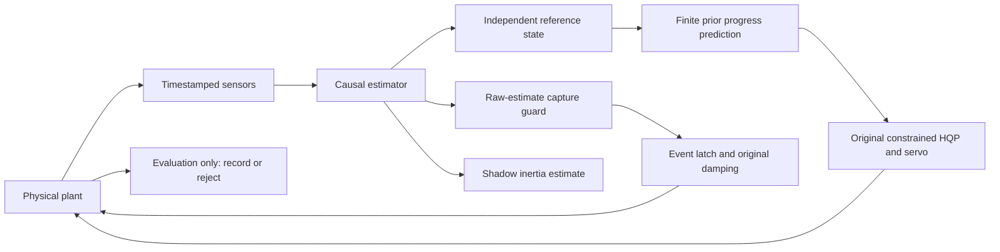

# Estimation- and Feasibility-Aware Continuous Capture and Momentum-Consistent Detumbling with a Free-Floating Single Arm

**Simulation systems study — evidence-limited V1.** No author affiliations, hardware validation, submission or acceptance status is asserted. This working title describes the research question. The present candidate has not demonstrated robust capture improvement.

## Abstract

Continuous capture of a passive tumbling object couples navigation, moving-frame reference generation, arm constraints and contact dynamics. We examine this coupling in a free-floating seven-joint arm with no active base or target actuators. A read-only reconstruction of three archived failures separates an empty linear hard-constraint set from solver or secondary-task failure. Independent Phase-I linear programs and joint-box certificates confirm conflicts between a pad–target clearance derivative and bounded joint commands. We implement a causal measurement-time estimator interface, an independent target-reference shaper and a bounded scalar progress governor evaluated on a separate prior model. In same-packet historical reanalysis, linear-velocity component RMS errors decrease from approximately 2.08–2.17 to 0.218–0.228 mm/s. A nominal continuous run captures at 7.992 s and completes the prescribed 20 s post-capture interval; its final two-second maximum world angular speed is 0.023554 deg/s. These results do not establish the intended nonideal operating domain: the selected candidate stops in the known multiaxis case, and uncertainty margins prevent noisy capture approval. Consequently, independent paired validation, ablation and fine-step evaluation are not admitted. We provide conditional geometric and momentum arguments, archived-source dual replay, and an explicit account of unsupported claims. The outcome is a reproducible partial prototype and a diagnosis of the remaining approach and sensing limitations.

## 1. Introduction

Capturing an uncooperative object requires the manipulator to follow motion that it does not command. The target remains a dynamical body throughout approach, contact and locking. The robot base also moves under internal reaction forces. A reference expressed relative to the target therefore contains both target transport and deliberate closing motion; stopping the latter does not stop the former. This distinction becomes critical when joint derivative limits and collision avoidance leave insufficient freedom to follow the target.

The other difficulty is informational. A pose estimate may be accurate while its differentiated velocity remains too uncertain for a narrow capture gate. Sending each estimate correction directly into a velocity reference can change the requested motion faster than the constrained servo can realize it. Enlarging covariance may correctly prevent a false approval, but it cannot create the precision required for successful capture. A successful deterministic replay tests implementation reproducibility, not robustness to this coupling.

This study asks whether modest changes to the estimator–reference interface and scalar progress selection can improve continuous capture while preserving the original hardware and contact requirements. We retain the same geometry, seven joint actuators, event latch and post-capture damping. The supported contributions are narrower than the initial hypothesis: (i) an independently checked decomposition of three historical hard-set failures; (ii) a reproducible implementation and bounded evaluation of the proposed interface and governor; and (iii) conditional analysis and transparent negative results that locate the remaining sensing and motion-domain gap. Improved robust capture, full-parameter convergence and globally safe recovery are not contributions established here.

## 2. Related work and actuator compatibility

Post-capture control and identification are relevant but do not alone validate an approach-to-contact pipeline. Wang et al. discuss integrated control after capture of a noncooperative target; Zhan et al. study adaptive reactionless detumbling under dynamic uncertainty; Gong et al. consider prescribed performance after capture. Only primary institutional or publisher abstracts were available for these three papers, so we do not attribute detailed equations or reproduce their controllers [@wang2018integrated; @zhan2022reactionless; @gong2024double]. A statement that an estimator does not require persistent excitation should not be read as absence of all finite-data information conditions.

The unified approach and grasp controller of Vijayan et al. uses a servicer with thrusters and reaction wheels as well as a manipulator [@vijayan2025unified]. That actuator distinction prevents direct import of its control authority or stability conclusions into the passive-base system considered here. We use its continuous-task framing for discussion, not as a numerical baseline on an incompatible plant.

Uchida et al. address momentum-based, physically consistent parameter estimation for an object already rigidly grasped by a manipulator [@uchida2025inertia]. Wensing et al. characterize structural inertial observability, which differs from the numerical rank of one collected regressor [@wensing2024observability]. Khorshidi et al. address physically consistent identification under rigid environmental contact [@khorshidi2025physical]. Those contact and information assumptions differ from a compliant event latch and finite online data. They motivate explicit physical-consistency and identifiability reporting without establishing control benefit for our shadow estimator.

The compliant explicit reference governor of Gautam et al. offers a related reference-management structure, under a fully actuated manipulator model and specified control properties [@gautam2026cerg]. Our sampled prior prediction does not inherit that theorem. The bibliography records the actual versions read: in particular, the second arXiv version of the latter work is dated 2026. The accompanying [literature matrix](related_work_matrix.csv) records full-text availability, equation locations, actuator and grasp assumptions. No cited method is claimed as a reproduced external numerical baseline.

## 3. System and problem formulation

The model contains a free robot base, seven actuated joints, the fixed 20 mm tool/interface geometry, and a passive rigid target with unknown mass, COM and inertia. Both floating bodies follow the simulator dynamics; neither receives a commanded base wrench or target spin. The only controller outputs are seven joint torques and a latch request. Contact and a compliant weld supply the internal interaction forces. The controller uses its declared nominal prior, never the true target mass matrix. True parameters and states are available to an evaluation-only observer that can reject a trial but cannot approve capture or correct an estimate.

The frozen capture thresholds are 0.1 mm position, 0.05 degree attitude, 1 mm/s relative linear velocity and 0.2 degree/s relative angular velocity. After locking, position and attitude limits are 0.5 mm and 0.1 degree. Actual interface load utilization is

$$\rho=\|F\|/(50\,\mathrm N)+\|M\|/(2\,\mathrm{Nm})\le1.$$

All original noncontact clearance, permitted interface penetration, joint, torque and separate linear/angular momentum checks remain active. Numerical geometric wrench terms are recorded separately and are not subtracted from actual safety quantities. The task allows at most 20 s approach and requires 20 s after locking. Performance uses the fixed final two seconds, world angular speed at most 0.1 degree/s and target–base relative angular speed at most 0.02 degree/s. A short safety-terminated prefix cannot satisfy this complete-window condition.

The physics and joint servo run every 2 ms; the hierarchical velocity task runs every 20 ms. The approach servo applies its actual bounded ramp between task commands. The primary QP minimizes tracking error subject to distance and joint feasibility inequalities. Tracking is already a soft least-squares objective. A secondary null-space objective regulates arm configuration; it is not an additional source of physical control authority.

## 4. Estimation, reference generation and progress selection

### 4.1 Causal interface

The estimator retains an SO(3) error-state formulation. A newly arrived observation updates the state at its measurement timestamp, followed by prediction to control time. A 0.25 s history stores the contact/process mode used over each past interval. Batches are sorted by measurement time; duplicate and older out-of-order samples are rejected rather than retrospectively assimilated. This is a declared rejection policy, not a general out-of-sequence smoother. NIS and innovation correction are logged only for new observations. Invalid or excessively old estimates produce an explicit `ESTIMATE_UNRELIABLE` stop.

For noisy operation, development reduced the free-motion acceleration process densities from 0.03/0.2 to 0.003 m/s^(3/2) and 0.02 rad/s^(3/2), while leaving the actual sensor noise, bias and delay unchanged. A contact mode multiplies process density by ten. These are engineering modeling choices with empirical error and coverage checks, not calibrated physical bounds. The primary noisy protocol samples pose every 6 ms and delivers it after 12 ms, with 10 micrometre and 35 microradian component noise standard deviations and the original biases.

An independent target-reference state follows the raw estimate through bounded acceleration and jerk. Translational substeps integrate constant jerk exactly. Rotation uses a Lie increment with a discretization approximation for noncommuting angular derivatives. The nominal ideal-state path remains unchanged. Capture tests use the raw timestamped estimate and its covariance, never the smoother reference state. Thus the controller cannot improve apparent alignment by moving the acceptance frame.

### 4.2 Geometry and progress

Using world W, target grasp G, flange F and tool-interface E frames, the desired transform is

$$T_{WF,d}=T_{WG,r}Q_{GE}(s)T_{FE}^{-1},\qquad s\in[0,1].$$

With target orientation R, flange offset q(s), target angular velocity omega and r=Rq, the translational velocity is

$$v_F=v+\omega\times r+Rq'(s)\dot s.$$

Angular transport and acceleration include the analogous path terms, the fixed tool offset, target acceleration and Coriolis terms. Complete expressions and frame conventions are in [theory_notes.md](theory_notes.md) and [notation_and_assumptions.md](notation_and_assumptions.md). The nominal relative path has zero first and second endpoint jets. Its composed physical reference can therefore remain smooth when the virtual path reaches its endpoint. This does not imply that a clamped scalar progress signal itself is twice differentiable.

Progress demand is filtered through three positive first-order stages with a 0.30 s time constant. At each task tick the governor tests demands of 1, 0.75, 0.5, 0.25 and 0 times the original maximum virtual-time rate, in descending order. Each candidate starts from the current declared measurement state and the same controller history. It integrates an independently built nominal-prior model for 0.20 s with the actual servo ramp, the original HQP and sampled contact model. It never reads future physical states.

Admission checks include hard QP feasibility, joint and geometry limits, actual ramp dynamics, tracking error, linear/angular task residual, estimated uncertainty and predicted contact load. Local clearance margins use a directional Jacobian covariance propagation and separate bias allowances. A three-sigma approximation is not a worst-case or joint-probability certificate. Prediction uses current-mode covariance propagation and no future measurement corrections; its conservatism and model mismatch are limitations.

Two candidate versions were permitted. The sole second-version revision allows the initial 0.20 s of soft task-residual transient, because the first version rejected the multiaxis case at its initial task tick despite a feasible hard set. Hard constraints are checked throughout. The position-error threshold remains 8 mm and the settled linear/angular residual thresholds remain 0.05 m/s and 0.10 rad/s. If all candidates fail, `NO_VERIFIED_CONTROL` terminates the simulation. No hardware-safe recovery law is inferred from that termination.

### 4.3 Event capture and post-capture control

The state machine proceeds through observation, rendezvous, relative approach, capture window, grasp verification, damping transfer and hold. Locking requires the original four estimated inequalities including uncertainty margins, sustained confirmation, a contact/load check and the unchanged prospective latch prediction. Independent physical evaluation rejects a false approval. After locking, the original load-governed joint damping is preserved. The inertial estimator remains in shadow mode; its posterior cannot change the approach or damping actions in this campaign.

## 5. Conditional analysis

For a frozen set of linear inequalities, the Phase-I program minimizes z subject to lower and upper bounds relaxed by positive row scales times z. An attained optimum z=0 is equivalent to nonempty original feasibility. A positive optimum above verified numerical tolerances indicates an empty frozen set. A second certificate maximizes a conflicting distance row over the joint-command box: if this upper bound is below the required lower bound, the combined set is empty. Changing a soft reference cannot alter that fixed contradiction.

Reference consistency follows from transform composition and differentiation. In particular, setting progress rate to zero leaves target transport velocity and angular velocity present. Accepted predicted constraints imply actual sampled constraints only if appropriate state/model/linearization/input-hold error bounds cover their slack. Such calibrated bounds and recursive feasibility have not been established here. We therefore prove the conditional inequality implication, not all-time safety of the switched controller.

With no external force or moment, ideal internal interaction pairs conserve total linear and angular momentum. Joint damping has power minus alpha times the weighted sum of squared joint velocities, hence nonpositive power when alpha and damping gains are nonnegative. Symmetric saturation preserves that sign. If all relative motion stops, common angular velocity equals the inverse locked inertia times conserved COM angular momentum. Nonzero momentum therefore generally precludes an exactly stationary assembly. Numerical soft-connection work, switch effects and energy residuals remain separate empirical quantities.

Finally, multiplying the mass and inertia of an isolated unforced rigid body by one positive constant leaves its pose dynamics unchanged for a fixed initial twist. Pose-only free motion cannot identify that common scale. A finite regressor's selected singular vectors define an update subspace, and a positive physical pseudoinertia imposes inertia triangle conditions; neither proves parameter accuracy or control utility. Detailed derivations and explicit `OPEN_GAP` labels are supplied in the theory notes.

## 6. Experimental protocol and reproducibility

The archived baseline commit is b1af09f89226fa6f2ae1b362f3d6225b3363cc17. Historical H1/H2/H3/S01 and nominal cases are all seen. They cannot serve as new independent validation. Source and configuration hashes, full packets, references, covariance, QP data, events, actuator inputs, plant trajectories and resource logs are saved for every new attempt, including early failures.

The bounded plan allows at most two candidate versions, eight development attempts and four final seen regressions. A selected version must pass nominal, H2, S01 and H1 before an independent validation freeze. The planned independent design has six physical clusters, three fixed sensor seeds and paired B0/B1 methods, followed by six prespecified B2 and two fine-step trials. Actual new scenario values are generated only after admission. Here admission fails, so these stages remain `NOT_EVALUATED`; the numerical generator has not been implemented or executed. The prespecified distribution and seed contract are retained for a future admitted campaign, without claiming they were validated.

B0 is the archived estimator/reference with fixed inertial prior plus the common explicit primary-only degradation rule; B1 adds the interface, margins and lookahead; B2 removes only lookahead from B1. No independent B0/B1 pairs or B2 runs were executed. Hence this study cannot estimate their paired effect or isolate a closed-loop mechanism by ablation. It does not use 500 Hz samples as independent trials, report a population success probability, or compute a significance test from seen repetitions.

Two independent replays are required for each attempt: one initializes the plant once at t=0 and reapplies recorded torque and latch events; another feeds the original packets through the corresponding archived controller source. The second also checks intermediate estimator, reference, guard, shadow-parameter and action identities. No trajectory state is injected into the first replay. Detailed numerical errors and validator identities are in each `validation.json`.

## 7. Results

### 7.1 Historical feasibility diagnosis

| Historical run | Classification | Dimensionless z | Conflict row | Required (m/s) | Box maximum (m/s) | Shortfall (m/s) |
|---|---|---|---|---|---|---|
| H2_prior | LINEAR_HARD_SET_INFEASIBLE | 0.0195548 | gripper_contact_pad__tumbling_target_geom | -0.127798 | -0.161947 | 0.0341494 |
| S01_noise_delay | LINEAR_HARD_SET_INFEASIBLE | 0.00550255 | gripper_contact_pad__tumbling_target_geom | -0.0372463 | -0.0467254 | 0.00947903 |
| D05_final_nominal | LINEAR_HARD_SET_INFEASIBLE | 0.000983 | gripper_contact_pad__tumbling_target_geom | -0.027238 | -0.0288792 | 0.00164122 |

In all three failures the distance rows alone and joint-box rows alone are feasible, but their intersection is empty. H2 requires the critical pad–target row to exceed approximately -0.127798 m/s, while its maximum over the joint box is approximately -0.161947 m/s. The 0.034149 m/s deficit is a derivative-command conflict, not a penetration depth. The archived H2 stop occurs before physical contact. These checks support a hard-set diagnosis at those instants; they do not prove that every alternative path is infeasible.

*Figure 1.* Archived failure snapshots over the final 0.5 s. Dimensionless Phase-I relaxation is normalized by 1 m/s for distance rows and 1 rad/s for joint rows. The terminal positive values identify mixed-unit linear-set conflicts. Full standalone captions and provenance are in figure_plan.md.

### 7.2 Same-packet perception and uncertainty

The offline historical S01 window is fixed at absolute time 1–7 s. New linear-velocity component RMS values are about one tenth of the archived values; angular components also decrease. Marginal empirical three-sigma coverage is descriptive and temporally correlated, not a joint confidence guarantee. The process-density and timestamp-interface changes are combined in this comparison.

*Figure 2.* Old and revised estimator velocity error norms on the same archived packets, without a new plant rollout. Reduced error does not establish successful or safer closed-loop capture.

| Run | Actual gate ticks | Audited1–7s samples | Uncertainty precludes gate | Minimum linear3sigma lower bound (m/s) | Minimum angular3sigma (rad/s) |
|---|---|---|---|---|---|
| D03_V1_S01 | 0 | 3001 | 3001 | 0.0016097 | 0.00964336 |
| R03_V2_S01 | 0 | 3001 | 3001 | 0.0016097 | 0.00964336 |

The noisy runs stop under predictive residual rejection before entering the capture-window state; their actual capture-guard call count is zero. The table therefore audits a necessary condition counterfactually on the raw covariance recorded over1–7 s. Velocity uncertainty allowances alone exceed the original1 mm/s or0.2 degree/s threshold in these samples; the linear lower bound even omits the nonnegative angular-offset term. A zero estimated error would still be insufficient to approve capture with these covariances. This is evidence of an implemented filter/gate incompatibility over the observed approach window, not an actual rejected latch request or a general impossibility theorem for the sensor or task.

### 7.3 Continuous task and recorded failures

| Run | Use | Status | End (s) | Latch (s) | World last2s (deg/s) | Peak rho | Safety violations | Dual replay |
|---|---|---|---|---|---|---|---|---|
| D01_V1_nominal | development | COMPLETED | 27.992 | 7.992 | 0.0235542 | 0.363223 | 0 | PENDING_OR_FAIL |
| D02_V1_H2 | development | NO_VERIFIED_CONTROL | 0.04 | NOT_EVALUATED | NOT_EVALUATED | 0 | 0 | PENDING_OR_FAIL |
| D03_V1_S01 | development | NO_VERIFIED_CONTROL | 7.84 | NOT_EVALUATED | NOT_EVALUATED | 0.0103905 | 0 | PENDING_OR_FAIL |
| D04_V2_H2 | development | NO_VERIFIED_CONTROL | 5.9 | NOT_EVALUATED | NOT_EVALUATED | 0 | 0 | PENDING_OR_FAIL |
| R01_V2_nominal | regression | COMPLETED | 27.992 | 7.992 | 0.0235542 | 0.363223 | 0 | PENDING_OR_FAIL |
| R02_V2_H2 | regression | NO_VERIFIED_CONTROL | 5.9 | NOT_EVALUATED | NOT_EVALUATED | 0 | 0 | PENDING_OR_FAIL |
| R03_V2_S01 | regression | NO_VERIFIED_CONTROL | 7.84 | NOT_EVALUATED | NOT_EVALUATED | 0.0103905 | 0 | PENDING_OR_FAIL |
| R04_V2_H1 | regression | COMPLETED | 27.932 | 7.932 | 0.0128079 | 0.597206 | 0 | PENDING_OR_FAIL |

The first nominal development run is the prespecified continuous-task illustration. It locks at 7.992 s and completes the full post-lock interval at 27.992 s. Peak actual rho is approximately 0.363223, with no recorded actual safety violation. Its final-window world angular speed is 0.023554 deg/s; that residual is consistent with an internally actuated assembly carrying nonzero angular momentum. It is not compared numerically with unrelated literature systems.

*Figure 3.* First nominal development run, chosen before the remaining outcomes. World/relative angular speeds, actual load utilization, and separate linear/angular momentum drift use absolute time. The vertical dashed line is locking; shading is the prescribed final two seconds.

The first H2 candidate stops at 0.04 s under a soft startup residual check. The second version removes only that initial transient rejection and stops later, at 5.90 s. All five demands are then rejected by the predictive task-residual criterion; the most permissive candidate does not establish a verified continuation. The noisy S01 first version reaches actual contact near 7.822 s but stops at 7.84 s. Near the path endpoint, candidate demands have little immediate effect on target transport and reference motion. Neither stop is task completion, an actual hardware recovery, nor proof of global geometric infeasibility.

*Figure 4.* Every ledger attempt, with category, stop time and outcome. Safety refers only to each recorded physical prefix. NE denotes a missing complete post-capture window; the failed attempt remains in task accounting. These repetitions are seen trials, not independent Bernoulli samples.

### 7.4 Computation, momentum and identification

The predictor repeatedly evaluates finite-difference distance gradients and constrained dynamics. Per-call timing substantially exceeds the 20 ms task deadline, with multi-second candidate evaluation at rejection. This Python prototype is not real-time ready. The [compute and momentum table](generated_tables/compute_and_momentum.md) separates latency, linear momentum and angular momentum quantities. Early development controller timing omitted the terminal exception call; predictor timing retains that omission's diagnostic context, and final regressions measure all calls externally. Resource accounting states its early serialization and tool-orchestration limitations.

*Figure 5.* Archived H1/H3 parameter-error histories and finite-data rank. H1 reaches numerical rank ten but retains about 15.28 mm COM error. Historical prior/identified action and state differences are zero despite posterior parameters entering prediction. Rank, parameter accuracy and control benefit remain distinct results.

The new campaign keeps parameter feedback disabled. Historical reanalysis therefore supports only a diagnostic discussion, with raw and whitened singular values computed without regularization. `CONTROL_BENEFIT_NOT_DEMONSTRATED` is retained; no adaptive-detumbling advantage is asserted.

## 8. Discussion and limitations

The main negative result is that better velocity estimation and a finite scalar governor do not suffice for the intended operating domain. A target's transport component may demand motion unavailable within the current derivative-constrained arm state. The progress filter also changes only slowly over a short prediction horizon. At the selected H2 rejection, the largest candidate spread in terminal virtual progress is only about0.001670 s over the0.20 s horizon, or0.000209 in normalized progress. The three-stage0.30 s filter therefore provides very little immediate candidate separation; it does not offer an instantaneous stop. Near the relative-path endpoint, that scalar has still less authority. A later study should characterize these limits explicitly before adding complexity to the post-grasp controller.

The noisy capture margin exposes a second requirement: error reduction and confidence calibration must be assessed against the actual narrow velocity gate. Artificially reducing covariance or widening capture thresholds would answer a different question. The current data identify a filter/gate limitation, leaving open whether a better dynamical observation model, additional declared measurements or another admissible path can satisfy the unchanged task.

No theorem covers the complete hybrid contact system, unmodeled dynamics, intersample constraints or a real stopping maneuver. The prior predictor uses a single contact model and approximate uncertainty propagation. The physical latch is a simulation connection, not an independently qualified clamp. The original full-boundary interface qualification failure remains unchanged, and no real hardware load claim is made. New statistical validation, module ablation, independent dynamics/contact replication and external compatible numerical baselines are absent. These are submission gaps, not small omitted details.

## 9. Conclusion

Independent reconstruction identifies genuine frozen hard-set conflicts in three historical failures. The implemented estimator/reference interface improves same-packet state estimates and preserves a successful nominal continuous run, but the selected governor does not establish completion in the required multiaxis and noisy cases. The campaign therefore ends as a partial operating-domain result, before independent validation. Its useful outcome is the reproducible distinction among feasibility, estimation accuracy, capture approval, physical task completion and replay correctness. Further performance claims require new evidence under a newly admitted, frozen protocol.

## Reproducibility and references

Canonical data, replay validations, identities and scripts are under `output/fpmfc/n209_paper_system`; the entry point is `python -m v6_mujoco.feasible_capture --all --resume`. Failed attempts are never implicitly retried. The exact evidence mapping is [claim_evidence_matrix.csv](claim_evidence_matrix.csv). Complete bibliographic records are in [references.bib](references.bib), with source URLs and version qualifications in [related_work_matrix.csv](related_work_matrix.csv). Bracketed citation keys are Pandoc-compatible references to that file.
